# C. UML Diagrams

## 1. Component Diagram - System Overview

```mermaid
graph TB
    subgraph "Client Layer"
        WebApp[Web Application]
        MobileApp[Mobile Application]
        AdminPortal[Admin Portal]
        PharmacyPortal[Pharmacy Portal]
    end

    subgraph "API Layer"
        Gateway[API Gateway<br/>:8080]
    end

    subgraph "Infrastructure Services"
        Registry[Service Registry<br/>Eureka :8761]
        Config[Config Server<br/>:8888]
    end

    subgraph "Core Business Services"
        UserSvc[User Service<br/>:8081]
        ApptSvc[Appointment Service<br/>:8082]
        EHRSvc[EHR Service<br/>:8083]
        PharmSvc[Pharmacy Service<br/>:8084]
        PaySvc[Payment Service<br/>:8086]
        AnalSvc[Analytics Service<br/>:8085]
    end

    subgraph "Supporting Services"
        NotifSvc[Notification Service<br/>:8087]
    end

    subgraph "Data Layer"
        UserDB[(User DB)]
        ApptDB[(Appointment DB)]
        EHRDB[(EHR DB)]
        PharmDB[(Pharmacy DB)]
        PayDB[(Payment DB)]
        AnalDB[(Analytics DB)]
        NotifDB[(Notification DB)]
    end

    subgraph "Message Layer"
        MQ[RabbitMQ<br/>Message Queue]
        Cache[Redis<br/>Cache]
    end

    WebApp --> Gateway
    MobileApp --> Gateway
    AdminPortal --> Gateway
    PharmacyPortal --> Gateway

    Gateway --> UserSvc
    Gateway --> ApptSvc
    Gateway --> EHRSvc
    Gateway --> PharmSvc
    Gateway --> PaySvc
    Gateway --> AnalSvc

    UserSvc --> Registry
    ApptSvc --> Registry
    EHRSvc --> Registry
    PharmSvc --> Registry
    PaySvc --> Registry
    AnalSvc --> Registry
    NotifSvc --> Registry

    UserSvc --> Config
    ApptSvc --> Config
    EHRSvc --> Config
    PharmSvc --> Config
    PaySvc --> Config
    AnalSvc --> Config
    NotifSvc --> Config

    UserSvc --> UserDB
    ApptSvc --> ApptDB
    EHRSvc --> EHRDB
    PharmSvc --> PharmDB
    PaySvc --> PayDB
    AnalSvc --> AnalDB
    NotifSvc --> NotifDB

    ApptSvc --> MQ
    EHRSvc --> MQ
    PharmSvc --> MQ
    PaySvc --> MQ
    NotifSvc --> MQ
    AnalSvc --> MQ

    UserSvc --> Cache
    ApptSvc --> Cache
    PharmSvc --> Cache
```

---

## 2. Class Diagram - User Service

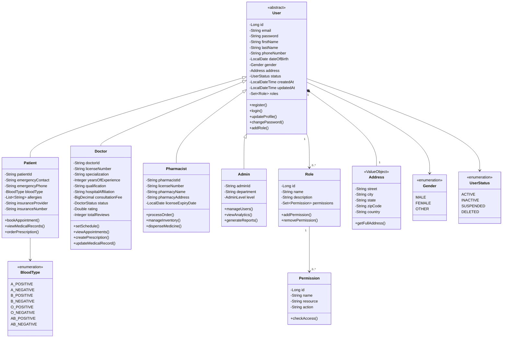
```mermaid
classDiagram
    class User {
        <<abstract>>
        -Long id
        -String email
        -String password
        -String firstName
        -String lastName
        -String phoneNumber
        -LocalDate dateOfBirth
        -Gender gender
        -Address address
        -UserStatus status
        -LocalDateTime createdAt
        -LocalDateTime updatedAt
        -Set~Role~ roles
        +register()
        +login()
        +updateProfile()
        +changePassword()
        +addRole()
    }

    class Patient {
        -String patientId
        -String emergencyContact
        -String emergencyPhone
        -BloodType bloodType
        -List~String~ allergies
        -String insuranceProvider
        -String insuranceNumber
        +bookAppointment()
        +viewMedicalRecords()
        +orderPrescription()
    }

    class Doctor {
        -String doctorId
        -String licenseNumber
        -String specialization
        -Integer yearsOfExperience
        -String qualification
        -String hospitalAffiliation
        -BigDecimal consultationFee
        -DoctorStatus status
        -Double rating
        -Integer totalReviews
        +setSchedule()
        +viewAppointments()
        +createPrescription()
        +updateMedicalRecord()
    }

    class Pharmacist {
        -String pharmacistId
        -String licenseNumber
        -String pharmacyName
        -String pharmacyAddress
        -LocalDate licenseExpiryDate
        +processOrder()
        +manageInventory()
        +dispenseMedicine()
    }

    class Admin {
        -String adminId
        -String department
        -AdminLevel level
        +manageUsers()
        +viewAnalytics()
        +generateReports()
    }

    class Role {
        -Long id
        -String name
        -String description
        -Set~Permission~ permissions
        +addPermission()
        +removePermission()
    }

    class Permission {
        -Long id
        -String name
        -String resource
        -String action
        +checkAccess()
    }

    class Address {
        <<ValueObject>>
        -String street
        -String city
        -String state
        -String zipCode
        -String country
        +getFullAddress()
    }

    class Gender {
        <<enumeration>>
        MALE
        FEMALE
        OTHER
    }

    class UserStatus {
        <<enumeration>>
        ACTIVE
        INACTIVE
        SUSPENDED
        DELETED
    }

    class BloodType {
        <<enumeration>>
        A_POSITIVE
        A_NEGATIVE
        B_POSITIVE
        B_NEGATIVE
        O_POSITIVE
        O_NEGATIVE
        AB_POSITIVE
        AB_NEGATIVE
    }

    User <|-- Patient
    User <|-- Doctor
    User <|-- Pharmacist
    User <|-- Admin
    User "1" *-- "1" Address
    User "1" --> "0..*" Role
    Role "1" --> "0..*" Permission
    User --> Gender
    User --> UserStatus
    Patient --> BloodType
```

---

## 3. Class Diagram - Appointment Service

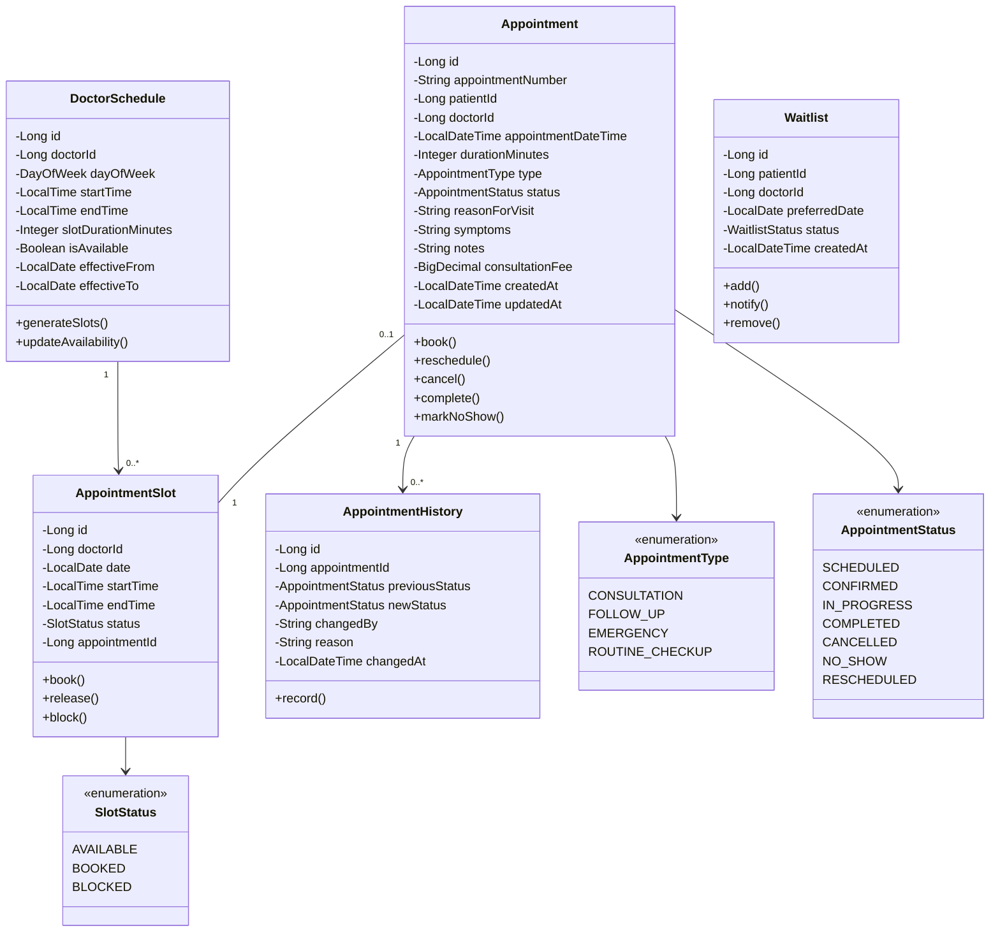
```mermaid
classDiagram
    class Appointment {
        -Long id
        -String appointmentNumber
        -Long patientId
        -Long doctorId
        -LocalDateTime appointmentDateTime
        -Integer durationMinutes
        -AppointmentType type
        -AppointmentStatus status
        -String reasonForVisit
        -String symptoms
        -String notes
        -BigDecimal consultationFee
        -LocalDateTime createdAt
        -LocalDateTime updatedAt
        +book()
        +reschedule()
        +cancel()
        +complete()
        +markNoShow()
    }

    class DoctorSchedule {
        -Long id
        -Long doctorId
        -DayOfWeek dayOfWeek
        -LocalTime startTime
        -LocalTime endTime
        -Integer slotDurationMinutes
        -Boolean isAvailable
        -LocalDate effectiveFrom
        -LocalDate effectiveTo
        +generateSlots()
        +updateAvailability()
    }

    class AppointmentSlot {
        -Long id
        -Long doctorId
        -LocalDate date
        -LocalTime startTime
        -LocalTime endTime
        -SlotStatus status
        -Long appointmentId
        +book()
        +release()
        +block()
    }

    class AppointmentHistory {
        -Long id
        -Long appointmentId
        -AppointmentStatus previousStatus
        -AppointmentStatus newStatus
        -String changedBy
        -String reason
        -LocalDateTime changedAt
        +record()
    }

    class Waitlist {
        -Long id
        -Long patientId
        -Long doctorId
        -LocalDate preferredDate
        -WaitlistStatus status
        -LocalDateTime createdAt
        +add()
        +notify()
        +remove()
    }

    class AppointmentType {
        <<enumeration>>
        CONSULTATION
        FOLLOW_UP
        EMERGENCY
        ROUTINE_CHECKUP
    }

    class AppointmentStatus {
        <<enumeration>>
        SCHEDULED
        CONFIRMED
        IN_PROGRESS
        COMPLETED
        CANCELLED
        NO_SHOW
        RESCHEDULED
    }

    class SlotStatus {
        <<enumeration>>
        AVAILABLE
        BOOKED
        BLOCKED
    }

    Appointment --> AppointmentType
    Appointment --> AppointmentStatus
    Appointment "0..1" -- "1" AppointmentSlot
    DoctorSchedule "1" --> "0..*" AppointmentSlot
    Appointment "1" --> "0..*" AppointmentHistory
    AppointmentSlot --> SlotStatus
```

---

## 4. Class Diagram - EHR Service

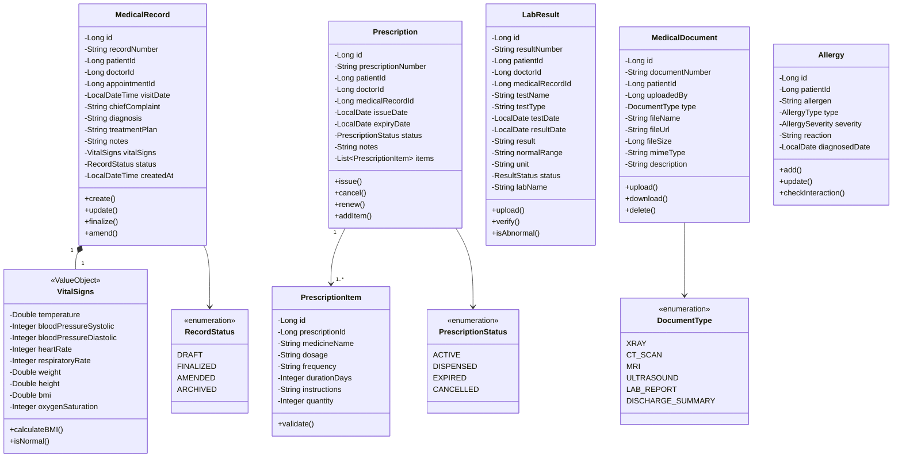
```mermaid
classDiagram
    class MedicalRecord {
        -Long id
        -String recordNumber
        -Long patientId
        -Long doctorId
        -Long appointmentId
        -LocalDateTime visitDate
        -String chiefComplaint
        -String diagnosis
        -String treatmentPlan
        -String notes
        -VitalSigns vitalSigns
        -RecordStatus status
        -LocalDateTime createdAt
        +create()
        +update()
        +finalize()
        +amend()
    }

    class VitalSigns {
        <<ValueObject>>
        -Double temperature
        -Integer bloodPressureSystolic
        -Integer bloodPressureDiastolic
        -Integer heartRate
        -Integer respiratoryRate
        -Double weight
        -Double height
        -Double bmi
        -Integer oxygenSaturation
        +calculateBMI()
        +isNormal()
    }

    class Prescription {
        -Long id
        -String prescriptionNumber
        -Long patientId
        -Long doctorId
        -Long medicalRecordId
        -LocalDate issueDate
        -LocalDate expiryDate
        -PrescriptionStatus status
        -String notes
        -List~PrescriptionItem~ items
        +issue()
        +cancel()
        +renew()
        +addItem()
    }

    class PrescriptionItem {
        -Long id
        -Long prescriptionId
        -String medicineName
        -String dosage
        -String frequency
        -Integer durationDays
        -String instructions
        -Integer quantity
        +validate()
    }

    class LabResult {
        -Long id
        -String resultNumber
        -Long patientId
        -Long doctorId
        -Long medicalRecordId
        -String testName
        -String testType
        -LocalDate testDate
        -LocalDate resultDate
        -String result
        -String normalRange
        -String unit
        -ResultStatus status
        -String labName
        +upload()
        +verify()
        +isAbnormal()
    }

    class MedicalDocument {
        -Long id
        -String documentNumber
        -Long patientId
        -Long uploadedBy
        -DocumentType type
        -String fileName
        -String fileUrl
        -Long fileSize
        -String mimeType
        -String description
        +upload()
        +download()
        +delete()
    }

    class Allergy {
        -Long id
        -Long patientId
        -String allergen
        -AllergyType type
        -AllergySeverity severity
        -String reaction
        -LocalDate diagnosedDate
        +add()
        +update()
        +checkInteraction()
    }

    class RecordStatus {
        <<enumeration>>
        DRAFT
        FINALIZED
        AMENDED
        ARCHIVED
    }

    class PrescriptionStatus {
        <<enumeration>>
        ACTIVE
        DISPENSED
        EXPIRED
        CANCELLED
    }

    class DocumentType {
        <<enumeration>>
        XRAY
        CT_SCAN
        MRI
        ULTRASOUND
        LAB_REPORT
        DISCHARGE_SUMMARY
    }

    MedicalRecord "1" *-- "1" VitalSigns
    MedicalRecord --> RecordStatus
    Prescription "1" --> "1..*" PrescriptionItem
    Prescription --> PrescriptionStatus
    MedicalDocument --> DocumentType
```

---

## 5. Class Diagram - Pharmacy Service

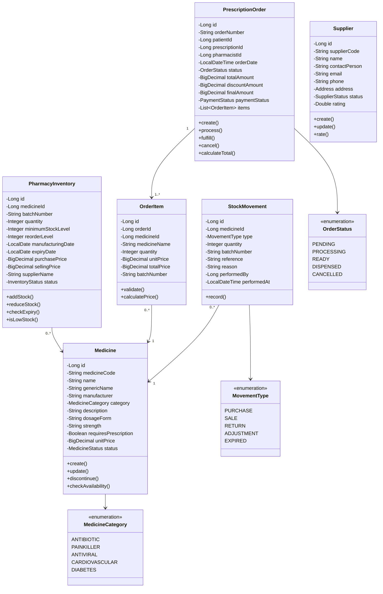
```mermaid
classDiagram
    class Medicine {
        -Long id
        -String medicineCode
        -String name
        -String genericName
        -String manufacturer
        -MedicineCategory category
        -String description
        -String dosageForm
        -String strength
        -Boolean requiresPrescription
        -BigDecimal unitPrice
        -MedicineStatus status
        +create()
        +update()
        +discontinue()
        +checkAvailability()
    }

    class PharmacyInventory {
        -Long id
        -Long medicineId
        -String batchNumber
        -Integer quantity
        -Integer minimumStockLevel
        -Integer reorderLevel
        -LocalDate manufacturingDate
        -LocalDate expiryDate
        -BigDecimal purchasePrice
        -BigDecimal sellingPrice
        -String supplierName
        -InventoryStatus status
        +addStock()
        +reduceStock()
        +checkExpiry()
        +isLowStock()
    }

    class PrescriptionOrder {
        -Long id
        -String orderNumber
        -Long patientId
        -Long prescriptionId
        -Long pharmacistId
        -LocalDateTime orderDate
        -OrderStatus status
        -BigDecimal totalAmount
        -BigDecimal discountAmount
        -BigDecimal finalAmount
        -PaymentStatus paymentStatus
        -List~OrderItem~ items
        +create()
        +process()
        +fulfill()
        +cancel()
        +calculateTotal()
    }

    class OrderItem {
        -Long id
        -Long orderId
        -Long medicineId
        -String medicineName
        -Integer quantity
        -BigDecimal unitPrice
        -BigDecimal totalPrice
        -String batchNumber
        +validate()
        +calculatePrice()
    }

    class StockMovement {
        -Long id
        -Long medicineId
        -MovementType type
        -Integer quantity
        -String batchNumber
        -String reference
        -String reason
        -Long performedBy
        -LocalDateTime performedAt
        +record()
    }

    class Supplier {
        -Long id
        -String supplierCode
        -String name
        -String contactPerson
        -String email
        -String phone
        -Address address
        -SupplierStatus status
        -Double rating
        +create()
        +update()
        +rate()
    }

    class MedicineCategory {
        <<enumeration>>
        ANTIBIOTIC
        PAINKILLER
        ANTIVIRAL
        CARDIOVASCULAR
        DIABETES
    }

    class OrderStatus {
        <<enumeration>>
        PENDING
        PROCESSING
        READY
        DISPENSED
        CANCELLED
    }

    class MovementType {
        <<enumeration>>
        PURCHASE
        SALE
        RETURN
        ADJUSTMENT
        EXPIRED
    }

    Medicine --> MedicineCategory
    PharmacyInventory "0..*" --> "1" Medicine
    PrescriptionOrder "1" --> "1..*" OrderItem
    OrderItem "0..*" --> "1" Medicine
    StockMovement "0..*" --> "1" Medicine
    PrescriptionOrder --> OrderStatus
    StockMovement --> MovementType
```

---

## 6. Class Diagram - Payment Service

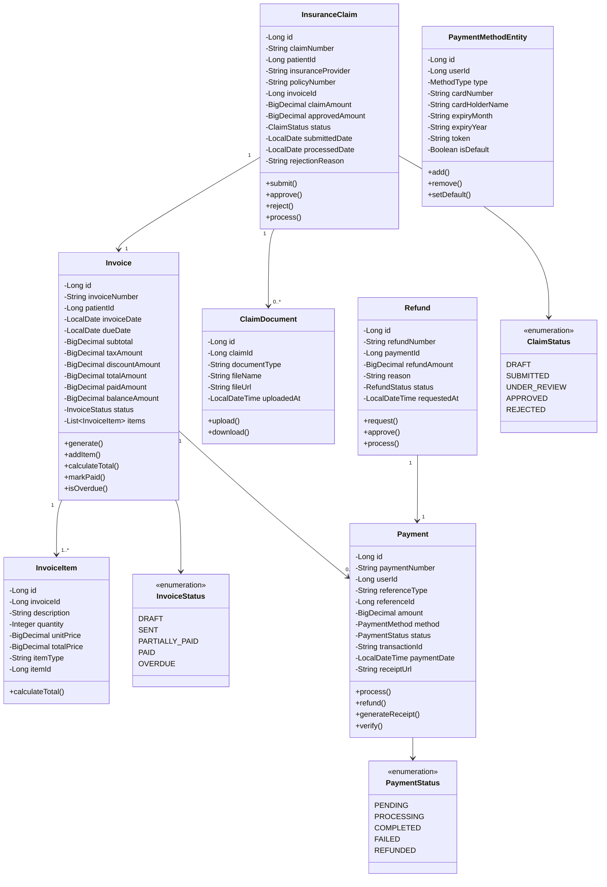
```mermaid
classDiagram
    class Payment {
        -Long id
        -String paymentNumber
        -Long userId
        -String referenceType
        -Long referenceId
        -BigDecimal amount
        -PaymentMethod method
        -PaymentStatus status
        -String transactionId
        -LocalDateTime paymentDate
        -String receiptUrl
        +process()
        +refund()
        +generateReceipt()
        +verify()
    }

    class Invoice {
        -Long id
        -String invoiceNumber
        -Long patientId
        -LocalDate invoiceDate
        -LocalDate dueDate
        -BigDecimal subtotal
        -BigDecimal taxAmount
        -BigDecimal discountAmount
        -BigDecimal totalAmount
        -BigDecimal paidAmount
        -BigDecimal balanceAmount
        -InvoiceStatus status
        -List~InvoiceItem~ items
        +generate()
        +addItem()
        +calculateTotal()
        +markPaid()
        +isOverdue()
    }

    class InvoiceItem {
        -Long id
        -Long invoiceId
        -String description
        -Integer quantity
        -BigDecimal unitPrice
        -BigDecimal totalPrice
        -String itemType
        -Long itemId
        +calculateTotal()
    }

    class InsuranceClaim {
        -Long id
        -String claimNumber
        -Long patientId
        -String insuranceProvider
        -String policyNumber
        -Long invoiceId
        -BigDecimal claimAmount
        -BigDecimal approvedAmount
        -ClaimStatus status
        -LocalDate submittedDate
        -LocalDate processedDate
        -String rejectionReason
        +submit()
        +approve()
        +reject()
        +process()
    }

    class ClaimDocument {
        -Long id
        -Long claimId
        -String documentType
        -String fileName
        -String fileUrl
        -LocalDateTime uploadedAt
        +upload()
        +download()
    }

    class PaymentMethodEntity {
        -Long id
        -Long userId
        -MethodType type
        -String cardNumber
        -String cardHolderName
        -String expiryMonth
        -String expiryYear
        -String token
        -Boolean isDefault
        +add()
        +remove()
        +setDefault()
    }

    class Refund {
        -Long id
        -String refundNumber
        -Long paymentId
        -BigDecimal refundAmount
        -String reason
        -RefundStatus status
        -LocalDateTime requestedAt
        +request()
        +approve()
        +process()
    }

    class PaymentStatus {
        <<enumeration>>
        PENDING
        PROCESSING
        COMPLETED
        FAILED
        REFUNDED
    }

    class InvoiceStatus {
        <<enumeration>>
        DRAFT
        SENT
        PARTIALLY_PAID
        PAID
        OVERDUE
    }

    class ClaimStatus {
        <<enumeration>>
        DRAFT
        SUBMITTED
        UNDER_REVIEW
        APPROVED
        REJECTED
    }

    Payment --> PaymentStatus
    Invoice "1" --> "1..*" InvoiceItem
    Invoice --> InvoiceStatus
    Invoice "1" --> "0..*" Payment
    InsuranceClaim "1" --> "1" Invoice
    InsuranceClaim "1" --> "0..*" ClaimDocument
    InsuranceClaim --> ClaimStatus
    Refund "1" --> "1" Payment
```

---

## 7. Class Diagram - Analytics Service

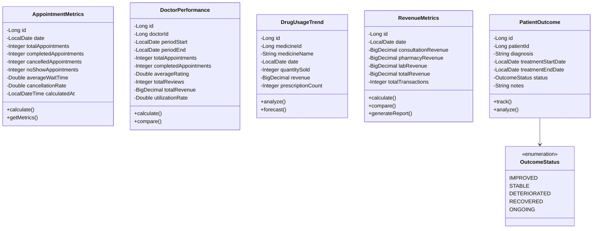
```mermaid
classDiagram
    class AppointmentMetrics {
        -Long id
        -LocalDate date
        -Integer totalAppointments
        -Integer completedAppointments
        -Integer cancelledAppointments
        -Integer noShowAppointments
        -Double averageWaitTime
        -Double cancellationRate
        -LocalDateTime calculatedAt
        +calculate()
        +getMetrics()
    }

    class DoctorPerformance {
        -Long id
        -Long doctorId
        -LocalDate periodStart
        -LocalDate periodEnd
        -Integer totalAppointments
        -Integer completedAppointments
        -Double averageRating
        -Integer totalReviews
        -BigDecimal totalRevenue
        -Double utilizationRate
        +calculate()
        +compare()
    }

    class DrugUsageTrend {
        -Long id
        -Long medicineId
        -String medicineName
        -LocalDate date
        -Integer quantitySold
        -BigDecimal revenue
        -Integer prescriptionCount
        +analyze()
        +forecast()
    }

    class RevenueMetrics {
        -Long id
        -LocalDate date
        -BigDecimal consultationRevenue
        -BigDecimal pharmacyRevenue
        -BigDecimal labRevenue
        -BigDecimal totalRevenue
        -Integer totalTransactions
        +calculate()
        +compare()
        +generateReport()
    }

    class PatientOutcome {
        -Long id
        -Long patientId
        -String diagnosis
        -LocalDate treatmentStartDate
        -LocalDate treatmentEndDate
        -OutcomeStatus status
        -String notes
        +track()
        +analyze()
    }

    class OutcomeStatus {
        <<enumeration>>
        IMPROVED
        STABLE
        DETERIORATED
        RECOVERED
        ONGOING
    }

    PatientOutcome --> OutcomeStatus
```

---

## 8. Class Diagram - Notification Service

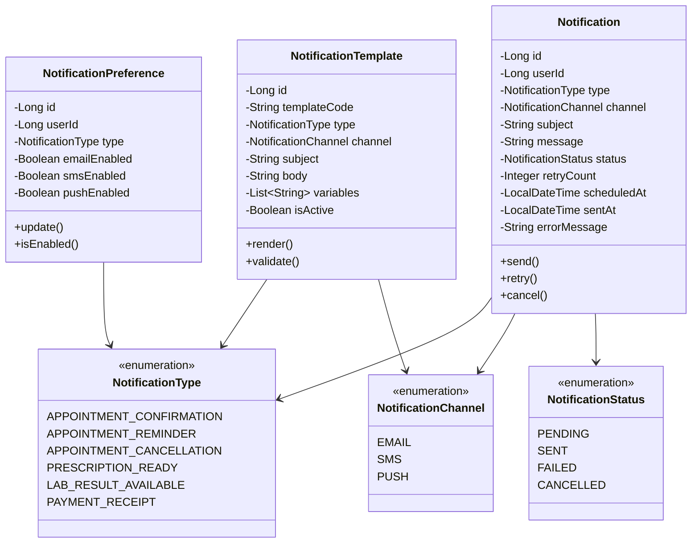
```mermaid
classDiagram
    class Notification {
        -Long id
        -Long userId
        -NotificationType type
        -NotificationChannel channel
        -String subject
        -String message
        -NotificationStatus status
        -Integer retryCount
        -LocalDateTime scheduledAt
        -LocalDateTime sentAt
        -String errorMessage
        +send()
        +retry()
        +cancel()
    }

    class NotificationTemplate {
        -Long id
        -String templateCode
        -NotificationType type
        -NotificationChannel channel
        -String subject
        -String body
        -List~String~ variables
        -Boolean isActive
        +render()
        +validate()
    }

    class NotificationPreference {
        -Long id
        -Long userId
        -NotificationType type
        -Boolean emailEnabled
        -Boolean smsEnabled
        -Boolean pushEnabled
        +update()
        +isEnabled()
    }

    class NotificationType {
        <<enumeration>>
        APPOINTMENT_CONFIRMATION
        APPOINTMENT_REMINDER
        APPOINTMENT_CANCELLATION
        PRESCRIPTION_READY
        LAB_RESULT_AVAILABLE
        PAYMENT_RECEIPT
    }

    class NotificationChannel {
        <<enumeration>>
        EMAIL
        SMS
        PUSH
    }

    class NotificationStatus {
        <<enumeration>>
        PENDING
        SENT
        FAILED
        CANCELLED
    }

    Notification --> NotificationType
    Notification --> NotificationChannel
    Notification --> NotificationStatus
    NotificationTemplate --> NotificationType
    NotificationTemplate --> NotificationChannel
    NotificationPreference --> NotificationType
```

---

## 9. Sequence Diagram - Appointment Booking Flow

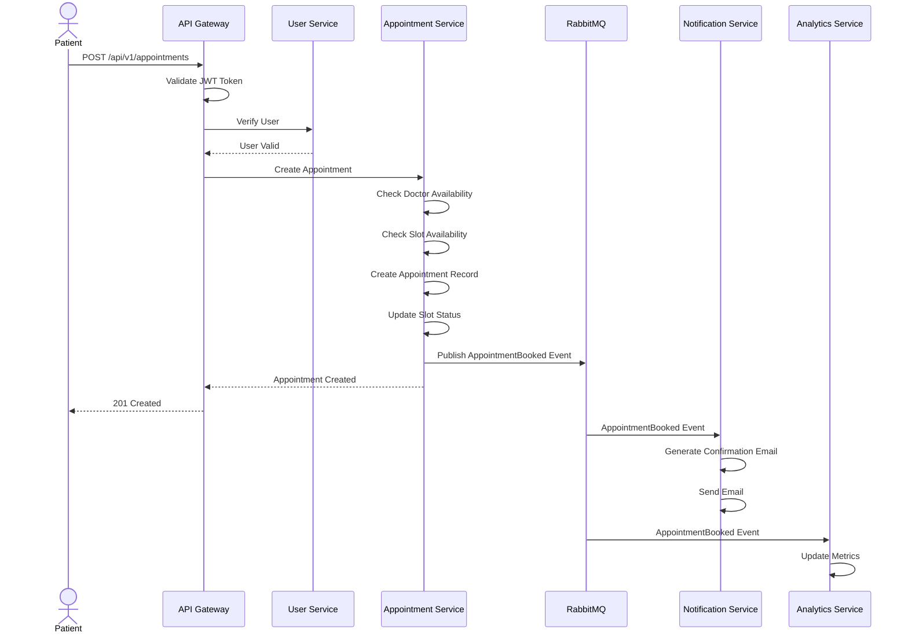
```mermaid
sequenceDiagram
    actor Patient
    participant Gateway as API Gateway
    participant UserSvc as User Service
    participant ApptSvc as Appointment Service
    participant MQ as RabbitMQ
    participant NotifSvc as Notification Service
    participant AnalSvc as Analytics Service

    Patient->>Gateway: POST /api/v1/appointments
    Gateway->>Gateway: Validate JWT Token
    Gateway->>UserSvc: Verify User
    UserSvc-->>Gateway: User Valid
    
    Gateway->>ApptSvc: Create Appointment
    ApptSvc->>ApptSvc: Check Doctor Availability
    ApptSvc->>ApptSvc: Check Slot Availability
    ApptSvc->>ApptSvc: Create Appointment Record
    ApptSvc->>ApptSvc: Update Slot Status
    
    ApptSvc->>MQ: Publish AppointmentBooked Event
    ApptSvc-->>Gateway: Appointment Created
    Gateway-->>Patient: 201 Created
    
    MQ->>NotifSvc: AppointmentBooked Event
    NotifSvc->>NotifSvc: Generate Confirmation Email
    NotifSvc->>NotifSvc: Send Email
    
    MQ->>AnalSvc: AppointmentBooked Event
    AnalSvc->>AnalSvc: Update Metrics
```

---

## 10. Sequence Diagram - Prescription Order Flow

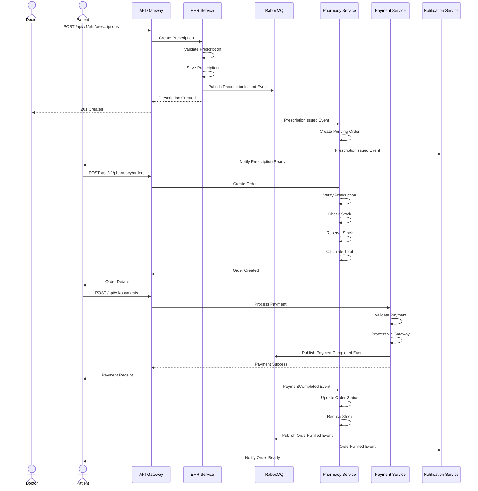
```mermaid
sequenceDiagram
    actor Doctor
    actor Patient
    participant Gateway as API Gateway
    participant EHRSvc as EHR Service
    participant MQ as RabbitMQ
    participant PharmSvc as Pharmacy Service
    participant PaySvc as Payment Service
    participant NotifSvc as Notification Service

    Doctor->>Gateway: POST /api/v1/ehr/prescriptions
    Gateway->>EHRSvc: Create Prescription
    EHRSvc->>EHRSvc: Validate Prescription
    EHRSvc->>EHRSvc: Save Prescription
    EHRSvc->>MQ: Publish PrescriptionIssued Event
    EHRSvc-->>Gateway: Prescription Created
    Gateway-->>Doctor: 201 Created

    MQ->>PharmSvc: PrescriptionIssued Event
    PharmSvc->>PharmSvc: Create Pending Order
    
    MQ->>NotifSvc: PrescriptionIssued Event
    NotifSvc->>Patient: Notify Prescription Ready

    Patient->>Gateway: POST /api/v1/pharmacy/orders
    Gateway->>PharmSvc: Create Order
    PharmSvc->>PharmSvc: Verify Prescription
    PharmSvc->>PharmSvc: Check Stock
    PharmSvc->>PharmSvc: Reserve Stock
    PharmSvc->>PharmSvc: Calculate Total
    PharmSvc-->>Gateway: Order Created
    Gateway-->>Patient: Order Details

    Patient->>Gateway: POST /api/v1/payments
    Gateway->>PaySvc: Process Payment
    PaySvc->>PaySvc: Validate Payment
    PaySvc->>PaySvc: Process via Gateway
    PaySvc->>MQ: Publish PaymentCompleted Event
    PaySvc-->>Gateway: Payment Success
    Gateway-->>Patient: Payment Receipt

    MQ->>PharmSvc: PaymentCompleted Event
    PharmSvc->>PharmSvc: Update Order Status
    PharmSvc->>PharmSvc: Reduce Stock
    PharmSvc->>MQ: Publish OrderFulfilled Event

    MQ->>NotifSvc: OrderFulfilled Event
    NotifSvc->>Patient: Notify Order Ready
```

---

## 11. Sequence Diagram - User Authentication Flow

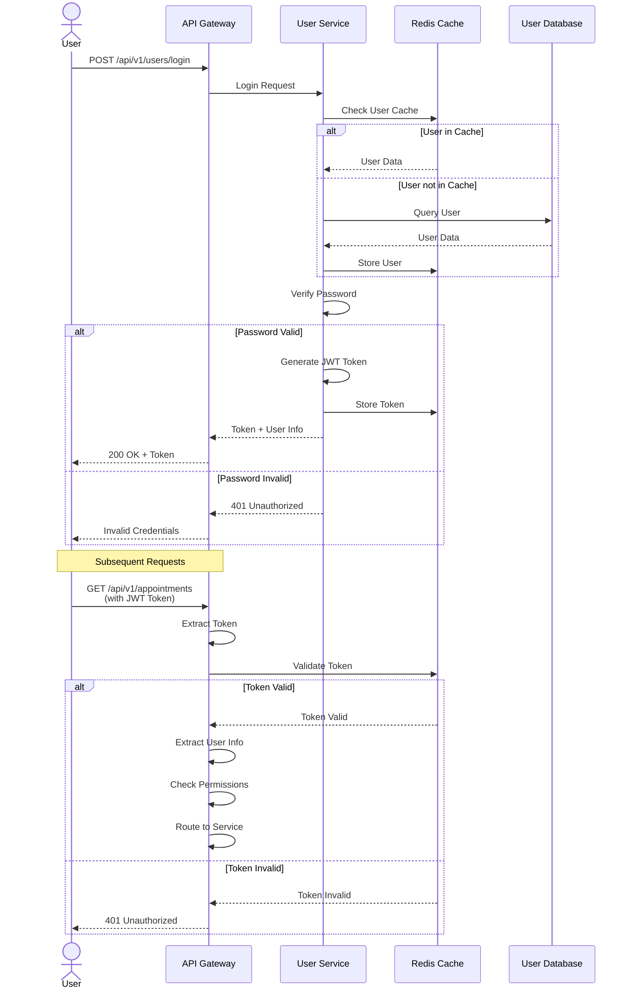
```mermaid
sequenceDiagram
    actor User
    participant Gateway as API Gateway
    participant UserSvc as User Service
    participant Cache as Redis Cache
    participant DB as User Database

    User->>Gateway: POST /api/v1/users/login
    Gateway->>UserSvc: Login Request
    
    UserSvc->>Cache: Check User Cache
    alt User in Cache
        Cache-->>UserSvc: User Data
    else User not in Cache
        UserSvc->>DB: Query User
        DB-->>UserSvc: User Data
        UserSvc->>Cache: Store User
    end
    
    UserSvc->>UserSvc: Verify Password
    
    alt Password Valid
        UserSvc->>UserSvc: Generate JWT Token
        UserSvc->>Cache: Store Token
        UserSvc-->>Gateway: Token + User Info
        Gateway-->>User: 200 OK + Token
    else Password Invalid
        UserSvc-->>Gateway: 401 Unauthorized
        Gateway-->>User: Invalid Credentials
    end

    Note over User,Gateway: Subsequent Requests

    User->>Gateway: GET /api/v1/appointments<br/>(with JWT Token)
    Gateway->>Gateway: Extract Token
    Gateway->>Cache: Validate Token
    
    alt Token Valid
        Cache-->>Gateway: Token Valid
        Gateway->>Gateway: Extract User Info
        Gateway->>Gateway: Check Permissions
        Gateway->>Gateway: Route to Service
    else Token Invalid
        Cache-->>Gateway: Token Invalid
        Gateway-->>User: 401 Unauthorized
    end
```

---

## 12. Deployment Diagram

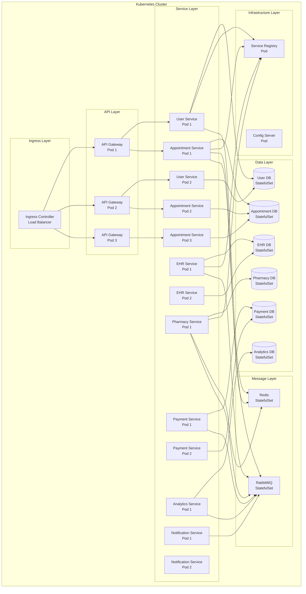
```mermaid
graph TB
    subgraph "Kubernetes Cluster"
        subgraph "Ingress Layer"
            Ingress[Ingress Controller<br/>Load Balancer]
        end

        subgraph "API Layer"
            Gateway1[API Gateway<br/>Pod 1]
            Gateway2[API Gateway<br/>Pod 2]
            Gateway3[API Gateway<br/>Pod 3]
        end

        subgraph "Service Layer"
            User1[User Service<br/>Pod 1]
            User2[User Service<br/>Pod 2]
            Appt1[Appointment Service<br/>Pod 1]
            Appt2[Appointment Service<br/>Pod 2]
            Appt3[Appointment Service<br/>Pod 3]
            EHR1[EHR Service<br/>Pod 1]
            EHR2[EHR Service<br/>Pod 2]
            Pharm1[Pharmacy Service<br/>Pod 1]
            Pay1[Payment Service<br/>Pod 1]
            Pay2[Payment Service<br/>Pod 2]
            Anal1[Analytics Service<br/>Pod 1]
            Notif1[Notification Service<br/>Pod 1]
            Notif2[Notification Service<br/>Pod 2]
        end

        subgraph "Infrastructure Layer"
            Registry[Service Registry<br/>Pod]
            Config[Config Server<br/>Pod]
        end

        subgraph "Data Layer"
            UserDB[(User DB<br/>StatefulSet)]
            ApptDB[(Appointment DB<br/>StatefulSet)]
            EHRDB[(EHR DB<br/>StatefulSet)]
            PharmDB[(Pharmacy DB<br/>StatefulSet)]
            PayDB[(Payment DB<br/>StatefulSet)]
            AnalDB[(Analytics DB<br/>StatefulSet)]
        end

        subgraph "Message Layer"
            RabbitMQ[RabbitMQ<br/>StatefulSet]
            Redis[Redis<br/>StatefulSet]
        end
    end

    Ingress --> Gateway1
    Ingress --> Gateway2
    Ingress --> Gateway3

    Gateway1 --> User1
    Gateway1 --> Appt1
    Gateway2 --> User2
    Gateway2 --> Appt2
    Gateway3 --> Appt3

    User1 --> UserDB
    User2 --> UserDB
    Appt1 --> ApptDB
    Appt2 --> ApptDB
    Appt3 --> ApptDB
    EHR1 --> EHRDB
    EHR2 --> EHRDB
    Pharm1 --> PharmDB
    Pay1 --> PayDB
    Pay2 --> PayDB
    Anal1 --> AnalDB

    User1 --> Registry
    Appt1 --> Registry
    EHR1 --> Registry
    Pharm1 --> Registry

    User1 --> Redis
    Appt1 --> Redis
    Pharm1 --> Redis

    Appt1 --> RabbitMQ
    EHR1 --> RabbitMQ
    Pharm1 --> RabbitMQ
    Pay1 --> RabbitMQ
    Notif1 --> RabbitMQ
    Anal1 --> RabbitMQ
```

---

## 13. State Diagram - Appointment Lifecycle

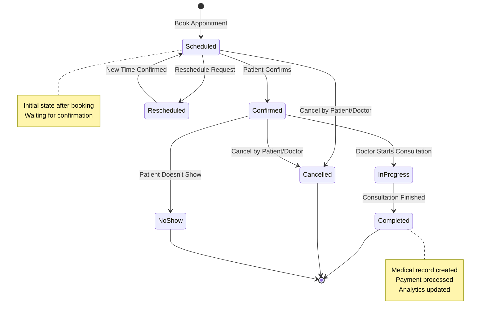
```mermaid
stateDiagram-v2
    [*] --> Scheduled: Book Appointment
    
    Scheduled --> Confirmed: Patient Confirms
    Scheduled --> Cancelled: Cancel by Patient/Doctor
    Scheduled --> Rescheduled: Reschedule Request
    
    Confirmed --> InProgress: Doctor Starts Consultation
    Confirmed --> NoShow: Patient Doesn't Show
    Confirmed --> Cancelled: Cancel by Patient/Doctor
    
    Rescheduled --> Scheduled: New Time Confirmed
    
    InProgress --> Completed: Consultation Finished
    
    Completed --> [*]
    Cancelled --> [*]
    NoShow --> [*]

    note right of Scheduled
        Initial state after booking
        Waiting for confirmation
    end note

    note right of Completed
        Medical record created
        Payment processed
        Analytics updated
    end note
```

---

## 14. State Diagram - Prescription Order Lifecycle

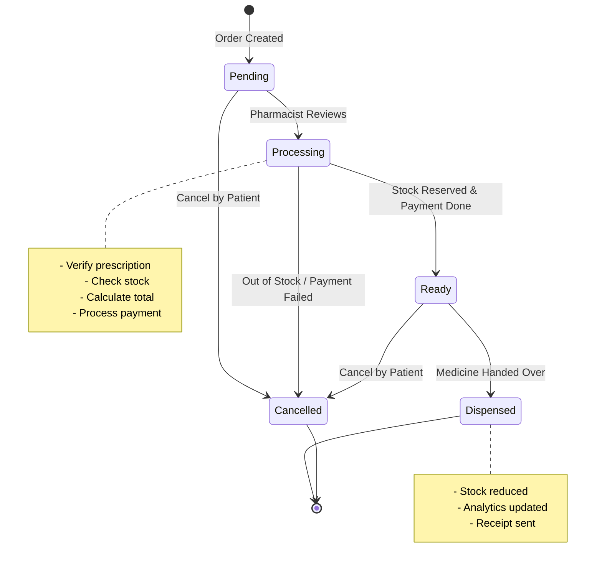
```mermaid
stateDiagram-v2
    [*] --> Pending: Order Created
    
    Pending --> Processing: Pharmacist Reviews
    Pending --> Cancelled: Cancel by Patient
    
    Processing --> Ready: Stock Reserved & Payment Done
    Processing --> Cancelled: Out of Stock / Payment Failed
    
    Ready --> Dispensed: Medicine Handed Over
    Ready --> Cancelled: Cancel by Patient
    
    Dispensed --> [*]
    Cancelled --> [*]

    note right of Processing
        - Verify prescription
        - Check stock
        - Calculate total
        - Process payment
    end note

    note right of Dispensed
        - Stock reduced
        - Analytics updated
        - Receipt sent
    end note
```

---

## 15. State Diagram - Payment Lifecycle

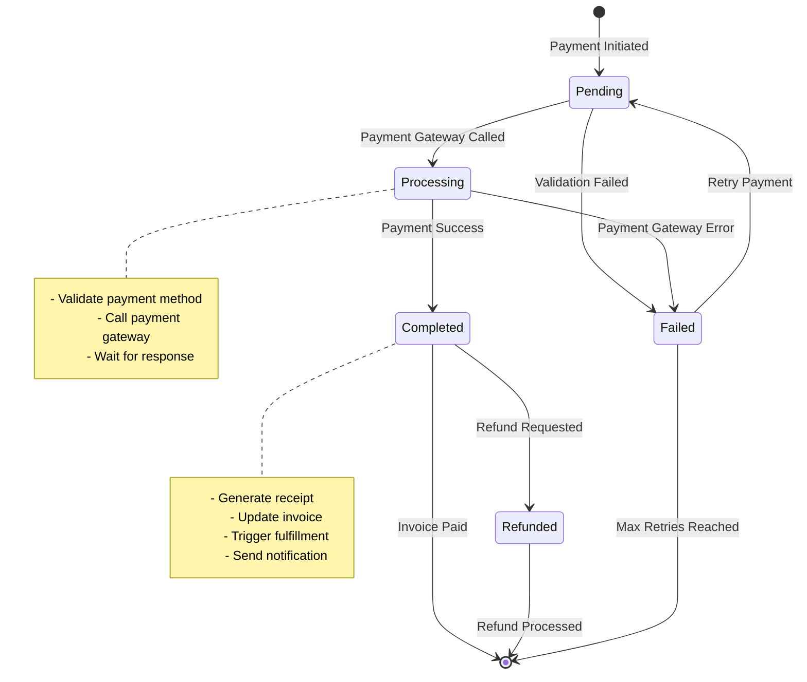
```mermaid
stateDiagram-v2
    [*] --> Pending: Payment Initiated
    
    Pending --> Processing: Payment Gateway Called
    Pending --> Failed: Validation Failed
    
    Processing --> Completed: Payment Success
    Processing --> Failed: Payment Gateway Error
    
    Completed --> Refunded: Refund Requested
    
    Failed --> Pending: Retry Payment
    
    Completed --> [*]: Invoice Paid
    Refunded --> [*]: Refund Processed
    Failed --> [*]: Max Retries Reached

    note right of Processing
        - Validate payment method
        - Call payment gateway
        - Wait for response
    end note

    note right of Completed
        - Generate receipt
        - Update invoice
        - Trigger fulfillment
        - Send notification
    end note
```

---

## 16. Activity Diagram - Patient Registration Flow

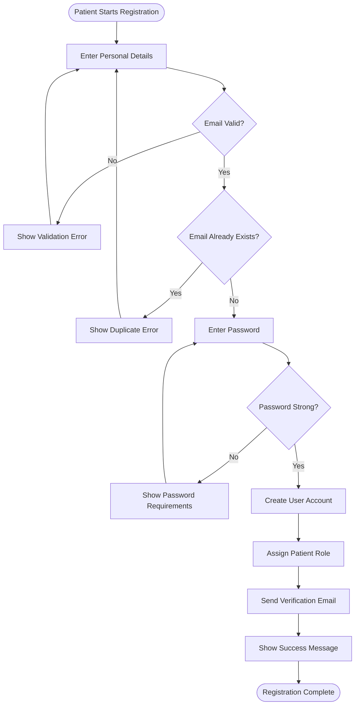
```mermaid
flowchart TD
    Start([Patient Starts Registration]) --> EnterDetails[Enter Personal Details]
    EnterDetails --> ValidateEmail{Email Valid?}
    
    ValidateEmail -->|No| ShowError1[Show Validation Error]
    ShowError1 --> EnterDetails
    
    ValidateEmail -->|Yes| CheckDuplicate{Email Already Exists?}
    
    CheckDuplicate -->|Yes| ShowError2[Show Duplicate Error]
    ShowError2 --> EnterDetails
    
    CheckDuplicate -->|No| EnterPassword[Enter Password]
    EnterPassword --> ValidatePassword{Password Strong?}
    
    ValidatePassword -->|No| ShowError3[Show Password Requirements]
    ShowError3 --> EnterPassword
    
    ValidatePassword -->|Yes| CreateUser[Create User Account]
    CreateUser --> AssignRole[Assign Patient Role]
    AssignRole --> SendVerification[Send Verification Email]
    SendVerification --> ShowSuccess[Show Success Message]
    ShowSuccess --> End([Registration Complete])
```

---

## Summary

Dokumentasi UML ini mencakup:

1. **Component Diagram**: Overview arsitektur sistem
2. **Class Diagrams**: Detail entities untuk setiap service
3. **Sequence Diagrams**: Flow interaksi antar services
4. **State Diagrams**: Lifecycle management untuk entities
5. **Activity Diagram**: Business process flows
6. **Deployment Diagram**: Infrastructure deployment

Semua diagram menggunakan Mermaid syntax yang dapat di-render di Markdown viewers yang support Mermaid (GitHub, GitLab, VS Code dengan extension, dll).
