# Laporan 03: Architecture Visualization

## MediTrack - Digital Healthcare Platform

---

## Daftar Isi
1. [High-Level Architecture Diagram](#a-high-level-architecture-diagram)
2. [Service Boundaries untuk Microservices](#b-service-boundaries-untuk-microservices)
3. [External Systems Integration](#c-external-systems-integration)

---

## Pendahuluan

Sebagai leader, penting bagi seluruh tim untuk memahami solusi arsitektur yang diusulkan. Laporan ini menyajikan visualisasi arsitektur MediTrack secara komprehensif dengan fokus pada:

- **Components & Services**: Semua komponen sistem dan microservices
- **Data Flow**: Aliran data antar komponen
- **Integration Points**: Titik integrasi internal dan eksternal
- **Service Boundaries**: Batasan yang jelas untuk setiap microservice
- **External Systems**: Integrasi dengan sistem eksternal

Dokumentasi ini menggunakan diagram Mermaid yang dapat di-render langsung di GitHub, GitLab, dan Markdown viewers modern.

---

## A. High-Level Architecture Diagram

### 1. Complete System Architecture

Diagram berikut menunjukkan arsitektur lengkap MediTrack dengan semua komponen, services, data flow, dan integration points.

```mermaid
graph TB
    subgraph "External Users"
        Patient[👤 Patient<br/>Web/Mobile]
        Doctor[👨‍⚕️ Doctor<br/>Web/Mobile]
        Pharmacist[💊 Pharmacist<br/>Web Portal]
        Admin[👨‍💼 Admin<br/>Admin Portal]
    end

    subgraph "CDN & Load Balancer"
        CDN[CDN<br/>Static Assets]
        LB[Load Balancer<br/>HTTPS/SSL]
    end

    subgraph "API Gateway Layer - Port 8080"
        Gateway[API Gateway<br/>Spring Cloud Gateway]
        Gateway_Auth[Authentication<br/>JWT Validation]
        Gateway_Rate[Rate Limiter<br/>Throttling]
        Gateway_Route[Router<br/>Service Discovery]
    end

    subgraph "Infrastructure Services"
        Registry[Service Registry<br/>Eureka Server<br/>Port: 8761]
        Config[Config Server<br/>Spring Cloud Config<br/>Port: 8888]
        ConfigRepo[(Git Repository<br/>Configuration Files)]
    end

    subgraph "Core Business Services"
        direction TB
        
        subgraph "User Service Boundary - Port 8081"
            UserSvc[User Service<br/>Authentication & Authorization]
            UserDB[(User Database<br/>PostgreSQL)]
        end

        subgraph "Appointment Service Boundary - Port 8082"
            ApptSvc[Appointment Service<br/>Scheduling & Management]
            ApptDB[(Appointment Database<br/>PostgreSQL)]
        end

        subgraph "EHR Service Boundary - Port 8083"
            EHRSvc[EHR Service<br/>Medical Records]
            EHRDB[(EHR Database<br/>PostgreSQL)]
            FileStorage[(File Storage<br/>S3/MinIO<br/>Medical Documents)]
        end

        subgraph "Pharmacy Service Boundary - Port 8084"
            PharmSvc[Pharmacy Service<br/>Inventory & Orders]
            PharmDB[(Pharmacy Database<br/>PostgreSQL)]
        end

        subgraph "Payment Service Boundary - Port 8086"
            PaySvc[Payment Service<br/>Payments & Claims]
            PayDB[(Payment Database<br/>PostgreSQL)]
        end

        subgraph "Analytics Service Boundary - Port 8085"
            AnalSvc[Analytics Service<br/>Reporting & Metrics]
            AnalDB[(Analytics Database<br/>PostgreSQL)]
            DataWarehouse[(Data Warehouse<br/>Historical Data)]
        end
    end

    subgraph "Supporting Services"
        subgraph "Notification Service Boundary - Port 8087"
            NotifSvc[Notification Service<br/>Multi-channel Notifications]
            NotifDB[(Notification Database<br/>PostgreSQL)]
        end
    end

    subgraph "Message & Cache Layer"
        MQ[Message Queue<br/>RabbitMQ<br/>Port: 5672]
        Cache[Cache Layer<br/>Redis<br/>Port: 6379]
    end

    subgraph "External Systems"
        PaymentGW[Payment Gateways<br/>Stripe, PayPal]
        EmailSvc[Email Service<br/>SendGrid, AWS SES]
        SMSSvc[SMS Service<br/>Twilio, AWS SNS]
        InsuranceAPI[Insurance Provider APIs<br/>Claims Processing]
        LabAPI[Laboratory APIs<br/>HL7/FHIR]
        PharmacyAPI[External Pharmacy APIs<br/>Drug Database]
    end

    subgraph "Monitoring & Logging"
        Prometheus[Prometheus<br/>Metrics Collection]
        Grafana[Grafana<br/>Dashboards]
        ELK[ELK Stack<br/>Centralized Logging]
        Zipkin[Zipkin<br/>Distributed Tracing]
    end

    %% User Connections
    Patient --> CDN
    Doctor --> CDN
    Pharmacist --> CDN
    Admin --> CDN
    
    Patient --> LB
    Doctor --> LB
    Pharmacist --> LB
    Admin --> LB

    %% Load Balancer to Gateway
    LB --> Gateway

    %% Gateway Internal Components
    Gateway --> Gateway_Auth
    Gateway --> Gateway_Rate
    Gateway --> Gateway_Route

    %% Gateway to Services
    Gateway_Route --> UserSvc
    Gateway_Route --> ApptSvc
    Gateway_Route --> EHRSvc
    Gateway_Route --> PharmSvc
    Gateway_Route --> PaySvc
    Gateway_Route --> AnalSvc

    %% Service Registry Connections
    UserSvc -.->|Register| Registry
    ApptSvc -.->|Register| Registry
    EHRSvc -.->|Register| Registry
    PharmSvc -.->|Register| Registry
    PaySvc -.->|Register| Registry
    AnalSvc -.->|Register| Registry
    NotifSvc -.->|Register| Registry
    Gateway -.->|Discover| Registry

    %% Config Server Connections
    Config --> ConfigRepo
    UserSvc -.->|Fetch Config| Config
    ApptSvc -.->|Fetch Config| Config
    EHRSvc -.->|Fetch Config| Config
    PharmSvc -.->|Fetch Config| Config
    PaySvc -.->|Fetch Config| Config
    AnalSvc -.->|Fetch Config| Config
    NotifSvc -.->|Fetch Config| Config

    %% Database Connections
    UserSvc --> UserDB
    ApptSvc --> ApptDB
    EHRSvc --> EHRDB
    EHRSvc --> FileStorage
    PharmSvc --> PharmDB
    PaySvc --> PayDB
    AnalSvc --> AnalDB
    AnalSvc --> DataWarehouse
    NotifSvc --> NotifDB

    %% Cache Connections
    UserSvc --> Cache
    ApptSvc --> Cache
    PharmSvc --> Cache
    Gateway --> Cache

    %% Message Queue Connections
    ApptSvc -->|Publish Events| MQ
    EHRSvc -->|Publish Events| MQ
    PharmSvc -->|Publish Events| MQ
    PaySvc -->|Publish Events| MQ
    NotifSvc -->|Consume Events| MQ
    AnalSvc -->|Consume Events| MQ

    %% External System Integrations
    PaySvc <-->|Payment Processing| PaymentGW
    PaySvc <-->|Claims Submission| InsuranceAPI
    NotifSvc -->|Send Emails| EmailSvc
    NotifSvc -->|Send SMS| SMSSvc
    EHRSvc <-->|Lab Results| LabAPI
    PharmSvc <-->|Drug Information| PharmacyAPI

    %% Monitoring Connections
    UserSvc -.->|Metrics| Prometheus
    ApptSvc -.->|Metrics| Prometheus
    EHRSvc -.->|Metrics| Prometheus
    PharmSvc -.->|Metrics| Prometheus
    PaySvc -.->|Metrics| Prometheus
    AnalSvc -.->|Metrics| Prometheus
    NotifSvc -.->|Metrics| Prometheus
    
    Prometheus --> Grafana
    
    UserSvc -.->|Logs| ELK
    ApptSvc -.->|Logs| ELK
    EHRSvc -.->|Logs| ELK
    PharmSvc -.->|Logs| ELK
    PaySvc -.->|Logs| ELK
    
    Gateway -.->|Traces| Zipkin
    UserSvc -.->|Traces| Zipkin
    ApptSvc -.->|Traces| Zipkin

    %% Styling
    classDef userClass fill:#e1f5ff,stroke:#01579b,stroke-width:2px
    classDef gatewayClass fill:#fff3e0,stroke:#e65100,stroke-width:3px
    classDef serviceClass fill:#f3e5f5,stroke:#4a148c,stroke-width:2px
    classDef dbClass fill:#e8f5e9,stroke:#1b5e20,stroke-width:2px
    classDef infraClass fill:#fff9c4,stroke:#f57f17,stroke-width:2px
    classDef externalClass fill:#ffebee,stroke:#b71c1c,stroke-width:2px
    classDef monitorClass fill:#e0f2f1,stroke:#004d40,stroke-width:2px

    class Patient,Doctor,Pharmacist,Admin userClass
    class Gateway,Gateway_Auth,Gateway_Rate,Gateway_Route gatewayClass
    class UserSvc,ApptSvc,EHRSvc,PharmSvc,PaySvc,AnalSvc,NotifSvc serviceClass
    class UserDB,ApptDB,EHRDB,PharmDB,PayDB,AnalDB,NotifDB,FileStorage,DataWarehouse dbClass
    class Registry,Config,MQ,Cache,ConfigRepo infraClass
    class PaymentGW,EmailSvc,SMSSvc,InsuranceAPI,LabAPI,PharmacyAPI externalClass
    class Prometheus,Grafana,ELK,Zipkin monitorClass
```

---

### 2. Layered Architecture View

Diagram ini menunjukkan arsitektur dalam bentuk layers untuk memudahkan pemahaman hierarki sistem.

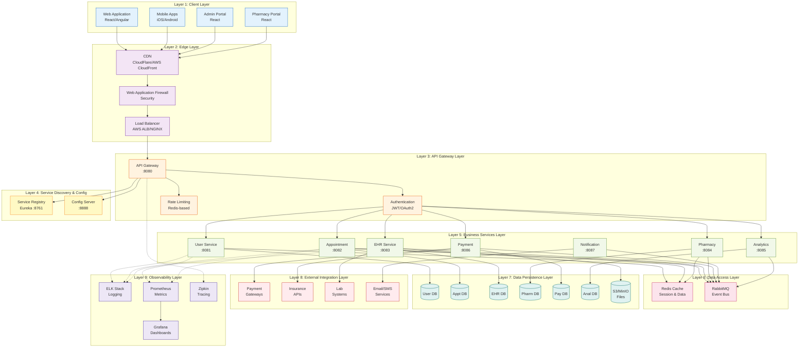

---

### 3. Data Flow Diagram - Appointment Booking

Diagram ini menunjukkan aliran data lengkap untuk use case appointment booking.

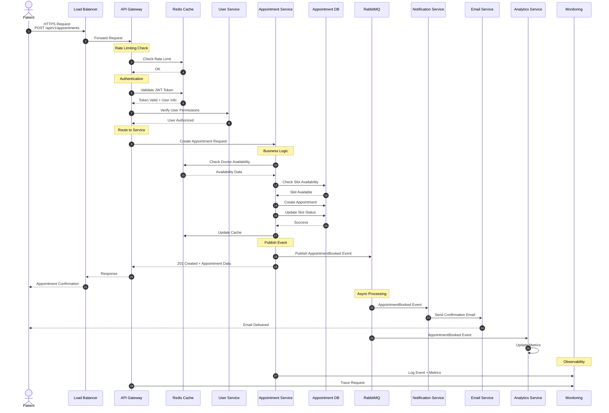

---

### 4. Data Flow Diagram - Prescription Order & Payment

Diagram ini menunjukkan aliran data untuk prescription order dengan payment processing.

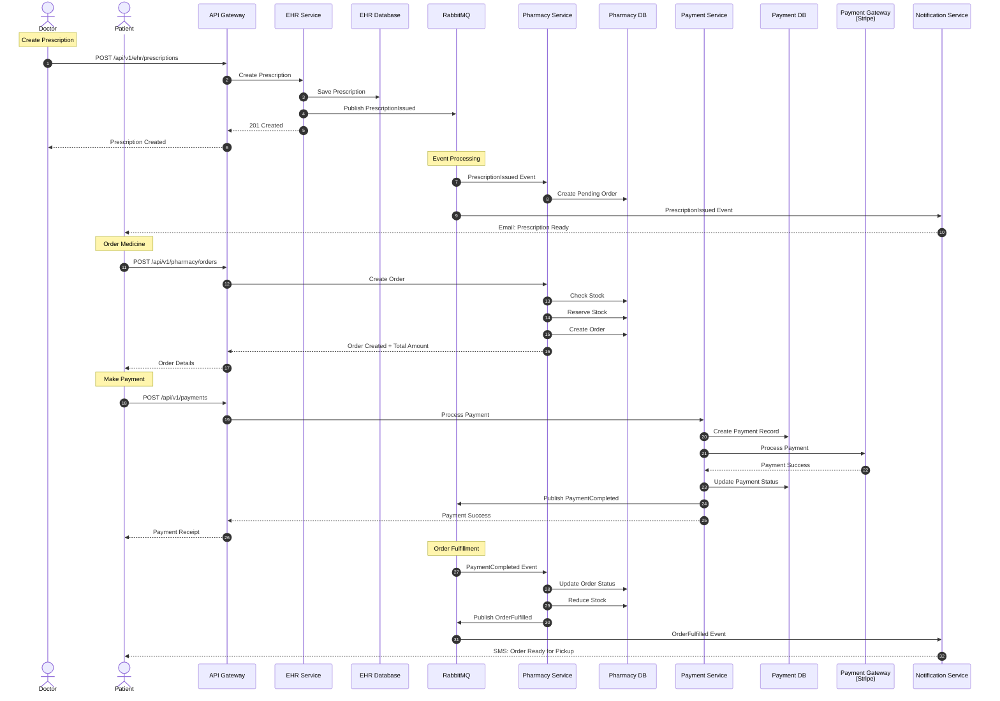

---

## B. Service Boundaries untuk Microservices

### 1. Service Boundary Diagram dengan Detail

Diagram ini menunjukkan batasan yang jelas untuk setiap microservice dengan detail komponen internal.

```mermaid
graph TB
    subgraph "API Gateway Boundary"
        direction TB
        GW_Main[API Gateway Core]
        GW_Auth[Auth Module]
        GW_Route[Routing Module]
        GW_Rate[Rate Limiter]
        GW_Circuit[Circuit Breaker]
        
        GW_Main --> GW_Auth
        GW_Main --> GW_Route
        GW_Main --> GW_Rate
        GW_Main --> GW_Circuit
    end

    subgraph "User Service Boundary"
        direction TB
        US_Controller[User Controller<br/>REST API]
        US_Service[User Service<br/>Business Logic]
        US_Repo[User Repository<br/>Data Access]
        US_Security[Security Module<br/>JWT/BCrypt]
        US_DB[(User Database)]
        
        US_Controller --> US_Service
        US_Service --> US_Repo
        US_Service --> US_Security
        US_Repo --> US_DB
    end

    subgraph "Appointment Service Boundary"
        direction TB
        AS_Controller[Appointment Controller]
        AS_Service[Appointment Service]
        AS_Scheduler[Scheduler Module]
        AS_Repo[Appointment Repository]
        AS_EventPub[Event Publisher]
        AS_DB[(Appointment Database)]
        
        AS_Controller --> AS_Service
        AS_Service --> AS_Scheduler
        AS_Service --> AS_Repo
        AS_Service --> AS_EventPub
        AS_Repo --> AS_DB
    end

    subgraph "EHR Service Boundary"
        direction TB
        EHR_Controller[EHR Controller]
        EHR_Service[EHR Service]
        EHR_Prescription[Prescription Module]
        EHR_LabResult[Lab Result Module]
        EHR_Repo[EHR Repository]
        EHR_Storage[File Storage Handler]
        EHR_EventPub[Event Publisher]
        EHR_DB[(EHR Database)]
        EHR_Files[(File Storage)]
        
        EHR_Controller --> EHR_Service
        EHR_Service --> EHR_Prescription
        EHR_Service --> EHR_LabResult
        EHR_Service --> EHR_Repo
        EHR_Service --> EHR_Storage
        EHR_Service --> EHR_EventPub
        EHR_Repo --> EHR_DB
        EHR_Storage --> EHR_Files
    end

    subgraph "Pharmacy Service Boundary"
        direction TB
        PS_Controller[Pharmacy Controller]
        PS_Service[Pharmacy Service]
        PS_Inventory[Inventory Module]
        PS_Order[Order Module]
        PS_Repo[Pharmacy Repository]
        PS_EventPub[Event Publisher]
        PS_EventSub[Event Subscriber]
        PS_DB[(Pharmacy Database)]
        
        PS_Controller --> PS_Service
        PS_Service --> PS_Inventory
        PS_Service --> PS_Order
        PS_Service --> PS_Repo
        PS_Service --> PS_EventPub
        PS_EventSub --> PS_Service
        PS_Repo --> PS_DB
    end

    subgraph "Payment Service Boundary"
        direction TB
        PAY_Controller[Payment Controller]
        PAY_Service[Payment Service]
        PAY_Gateway[Payment Gateway Handler]
        PAY_Insurance[Insurance Module]
        PAY_Repo[Payment Repository]
        PAY_EventPub[Event Publisher]
        PAY_DB[(Payment Database)]
        
        PAY_Controller --> PAY_Service
        PAY_Service --> PAY_Gateway
        PAY_Service --> PAY_Insurance
        PAY_Service --> PAY_Repo
        PAY_Service --> PAY_EventPub
        PAY_Repo --> PAY_DB
    end

    subgraph "Analytics Service Boundary"
        direction TB
        AN_Controller[Analytics Controller]
        AN_Service[Analytics Service]
        AN_Aggregator[Data Aggregator]
        AN_Reporter[Report Generator]
        AN_EventSub[Event Subscriber]
        AN_Repo[Analytics Repository]
        AN_DB[(Analytics Database)]
        AN_DW[(Data Warehouse)]
        
        AN_Controller --> AN_Service
        AN_Service --> AN_Aggregator
        AN_Service --> AN_Reporter
        AN_EventSub --> AN_Aggregator
        AN_Service --> AN_Repo
        AN_Repo --> AN_DB
        AN_Aggregator --> AN_DW
    end

    subgraph "Notification Service Boundary"
        direction TB
        NOT_EventSub[Event Subscriber]
        NOT_Service[Notification Service]
        NOT_Email[Email Handler]
        NOT_SMS[SMS Handler]
        NOT_Template[Template Engine]
        NOT_Repo[Notification Repository]
        NOT_DB[(Notification Database)]
        
        NOT_EventSub --> NOT_Service
        NOT_Service --> NOT_Email
        NOT_Service --> NOT_SMS
        NOT_Service --> NOT_Template
        NOT_Service --> NOT_Repo
        NOT_Repo --> NOT_DB
    end

    subgraph "Shared Infrastructure"
        MQ[RabbitMQ<br/>Message Queue]
        Cache[Redis<br/>Cache]
        Registry[Eureka<br/>Service Registry]
        Config[Config Server]
    end

    %% Gateway to Services
    GW_Route -.->|HTTP/REST| US_Controller
    GW_Route -.->|HTTP/REST| AS_Controller
    GW_Route -.->|HTTP/REST| EHR_Controller
    GW_Route -.->|HTTP/REST| PS_Controller
    GW_Route -.->|HTTP/REST| PAY_Controller
    GW_Route -.->|HTTP/REST| AN_Controller

    %% Event Publishing
    AS_EventPub -->|Events| MQ
    EHR_EventPub -->|Events| MQ
    PS_EventPub -->|Events| MQ
    PAY_EventPub -->|Events| MQ

    %% Event Subscription
    MQ -->|Events| PS_EventSub
    MQ -->|Events| AN_EventSub
    MQ -->|Events| NOT_EventSub

    %% Cache Usage
    US_Service -.->|Cache| Cache
    AS_Service -.->|Cache| Cache
    PS_Service -.->|Cache| Cache

    %% Service Registration
    US_Service -.->|Register| Registry
    AS_Service -.->|Register| Registry
    EHR_Service -.->|Register| Registry
    PS_Service -.->|Register| Registry
    PAY_Service -.->|Register| Registry
    AN_Service -.->|Register| Registry
    NOT_Service -.->|Register| Registry

    classDef boundaryStyle fill:#e8eaf6,stroke:#3f51b5,stroke-width:3px,stroke-dasharray: 5 5
    classDef controllerStyle fill:#fff3e0,stroke:#ff6f00,stroke-width:2px
    classDef serviceStyle fill:#e0f2f1,stroke:#00695c,stroke-width:2px
    classDef dbStyle fill:#f3e5f5,stroke:#6a1b9a,stroke-width:2px
    classDef infraStyle fill:#fff9c4,stroke:#f57f17,stroke-width:2px

    class US_Controller,AS_Controller,EHR_Controller,PS_Controller,PAY_Controller,AN_Controller controllerStyle
    class US_Service,AS_Service,EHR_Service,PS_Service,PAY_Service,AN_Service,NOT_Service serviceStyle
    class US_DB,AS_DB,EHR_DB,PS_DB,PAY_DB,AN_DB,NOT_DB,EHR_Files,AN_DW dbStyle
    class MQ,Cache,Registry,Config infraStyle
```

---

### 2. Service Communication Patterns

Diagram ini menunjukkan pola komunikasi antar services dengan jelas.

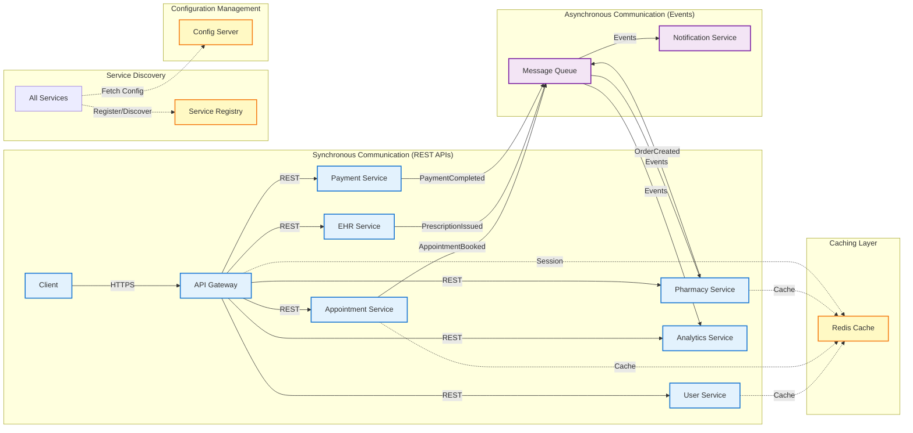

---

### 3. Database per Service Pattern

Diagram ini menunjukkan isolasi database untuk setiap service.

```mermaid
graph TB
    subgraph "Service Layer"
        US[User Service]
        AS[Appointment Service]
        ES[EHR Service]
        PS[Pharmacy Service]
        PAS[Payment Service]
        ANS[Analytics Service]
        NS[Notification Service]
    end

    subgraph "Database Layer - Isolated per Service"
        subgraph "User Service Database"
            USDB[(PostgreSQL<br/>Port: 5432)]
            USDB_Tables[Tables:<br/>- users<br/>- patients<br/>- doctors<br/>- roles<br/>- permissions]
        end

        subgraph "Appointment Service Database"
            ASDB[(PostgreSQL<br/>Port: 5433)]
            ASDB_Tables[Tables:<br/>- appointments<br/>- doctor_schedules<br/>- appointment_slots<br/>- waitlist]
        end

        subgraph "EHR Service Database"
            ESDB[(PostgreSQL<br/>Port: 5434)]
            ESDB_Tables[Tables:<br/>- medical_records<br/>- prescriptions<br/>- lab_results<br/>- allergies]
            FileStore[(S3/MinIO<br/>Medical Documents)]
        end

        subgraph "Pharmacy Service Database"
            PSDB[(PostgreSQL<br/>Port: 5435)]
            PSDB_Tables[Tables:<br/>- medicines<br/>- inventory<br/>- orders<br/>- stock_movements]
        end

        subgraph "Payment Service Database"
            PASDB[(PostgreSQL<br/>Port: 5436)]
            PASDB_Tables[Tables:<br/>- payments<br/>- invoices<br/>- insurance_claims<br/>- refunds]
        end

        subgraph "Analytics Service Database"
            ANSDB[(PostgreSQL<br/>Port: 5437)]
            ANSDB_Tables[Tables:<br/>- appointment_metrics<br/>- doctor_performance<br/>- revenue_metrics]
            DW[(Data Warehouse<br/>Historical Data)]
        end

        subgraph "Notification Service Database"
            NSDB[(PostgreSQL<br/>Port: 5438)]
            NSDB_Tables[Tables:<br/>- notifications<br/>- templates<br/>- preferences]
        end
    end

    US -->|Owns| USDB
    AS -->|Owns| ASDB
    ES -->|Owns| ESDB
    ES -->|Owns| FileStore
    PS -->|Owns| PSDB
    PAS -->|Owns| PASDB
    ANS -->|Owns| ANSDB
    ANS -->|Owns| DW
    NS -->|Owns| NSDB

    USDB -.-> USDB_Tables
    ASDB -.-> ASDB_Tables
    ESDB -.-> ESDB_Tables
    PSDB -.-> PSDB_Tables
    PASDB -.-> PASDB_Tables
    ANSDB -.-> ANSDB_Tables
    NSDB -.-> NSDB_Tables

    Note1[❌ No Direct Database Access<br/>Between Services]
    Note2[✅ Communication via APIs<br/>and Events Only]

    classDef serviceStyle fill:#e1f5fe,stroke:#01579b,stroke-width:2px
    classDef dbStyle fill:#f3e5f5,stroke:#4a148c,stroke-width:2px
    classDef noteStyle fill:#fff9c4,stroke:#f57f17,stroke-width:2px

    class US,AS,ES,PS,PAS,ANS,NS serviceStyle
    class USDB,ASDB,ESDB,PSDB,PASDB,ANSDB,NSDB,FileStore,DW dbStyle
    class Note1,Note2 noteStyle
```

---

## C. External Systems Integration

### 1. External Integration Architecture

Diagram ini menunjukkan bagaimana sistem MediTrack berinteraksi dengan external systems.

```mermaid
graph TB
    subgraph "MediTrack Platform"
        Gateway[API Gateway]
        
        subgraph "Internal Services"
            PaySvc[Payment Service]
            EHRSvc[EHR Service]
            PharmSvc[Pharmacy Service]
            NotifSvc[Notification Service]
        end
    end

    subgraph "Payment & Financial Systems"
        Stripe[Stripe Payment Gateway<br/>REST API<br/>https://api.stripe.com]
        PayPal[PayPal Payment Gateway<br/>REST API<br/>https://api.paypal.com]
        Insurance1[Insurance Provider A<br/>Claims API<br/>SOAP/REST]
        Insurance2[Insurance Provider B<br/>Claims API<br/>REST]
    end

    subgraph "Healthcare Systems"
        LabSystem1[Laboratory System A<br/>HL7 Interface<br/>FHIR API]
        LabSystem2[Laboratory System B<br/>HL7 v2.x<br/>TCP/IP]
        DrugDB[Drug Database<br/>RxNorm API<br/>https://rxnav.nlm.nih.gov]
        PharmacyAPI[External Pharmacy Network<br/>REST API]
    end

    subgraph "Communication Services"
        SendGrid[SendGrid Email Service<br/>REST API<br/>https://api.sendgrid.com]
        AWSSES[AWS SES<br/>SMTP/API<br/>email.amazonaws.com]
        Twilio[Twilio SMS Service<br/>REST API<br/>https://api.twilio.com]
        AWSSNS[AWS SNS<br/>SMS Service<br/>sns.amazonaws.com]
        FCM[Firebase Cloud Messaging<br/>Push Notifications<br/>fcm.googleapis.com]
    end

    subgraph "Cloud Storage"
        S3[AWS S3<br/>Object Storage<br/>Medical Documents]
        MinIO[MinIO<br/>Self-hosted Storage<br/>Alternative to S3]
    end

    subgraph "Identity Providers (Future)"
        Google[Google OAuth<br/>Social Login]
        Facebook[Facebook OAuth<br/>Social Login]
        SAML[SAML 2.0<br/>Enterprise SSO]
    end

    %% Payment Service Integrations
    PaySvc <-->|HTTPS/REST<br/>Payment Processing| Stripe
    PaySvc <-->|HTTPS/REST<br/>Payment Processing| PayPal
    PaySvc <-->|HTTPS/REST/SOAP<br/>Claims Submission| Insurance1
    PaySvc <-->|HTTPS/REST<br/>Claims Verification| Insurance2

    %% EHR Service Integrations
    EHRSvc <-->|HL7 FHIR<br/>Lab Results| LabSystem1
    EHRSvc <-->|HL7 v2.x<br/>Lab Orders| LabSystem2
    EHRSvc -->|HTTPS<br/>Upload Documents| S3
    EHRSvc -->|HTTPS<br/>Upload Documents| MinIO

    %% Pharmacy Service Integrations
    PharmSvc <-->|HTTPS/REST<br/>Drug Information| DrugDB
    PharmSvc <-->|HTTPS/REST<br/>Stock Sync| PharmacyAPI

    %% Notification Service Integrations
    NotifSvc -->|HTTPS/REST<br/>Send Emails| SendGrid
    NotifSvc -->|SMTP/API<br/>Send Emails| AWSSES
    NotifSvc -->|HTTPS/REST<br/>Send SMS| Twilio
    NotifSvc -->|HTTPS/API<br/>Send SMS| AWSSNS
    NotifSvc -->|HTTPS/REST<br/>Push Notifications| FCM

    %% Gateway Integrations (Future)
    Gateway -.->|OAuth 2.0<br/>Social Login| Google
    Gateway -.->|OAuth 2.0<br/>Social Login| Facebook
    Gateway -.->|SAML 2.0<br/>Enterprise SSO| SAML

    classDef internalStyle fill:#e8f5e9,stroke:#2e7d32,stroke-width:2px
    classDef paymentStyle fill:#fff3e0,stroke:#e65100,stroke-width:2px
    classDef healthcareStyle fill:#e1f5fe,stroke:#01579b,stroke-width:2px
    classDef commStyle fill:#f3e5f5,stroke:#6a1b9a,stroke-width:2px
    classDef storageStyle fill:#fce4ec,stroke:#c2185b,stroke-width:2px
    classDef identityStyle fill:#fff9c4,stroke:#f57f17,stroke-width:2px

    class Gateway,PaySvc,EHRSvc,PharmSvc,NotifSvc internalStyle
    class Stripe,PayPal,Insurance1,Insurance2 paymentStyle
    class LabSystem1,LabSystem2,DrugDB,PharmacyAPI healthcareStyle
    class SendGrid,AWSSES,Twilio,AWSSNS,FCM commStyle
    class S3,MinIO storageStyle
    class Google,Facebook,SAML identityStyle
```

---

### 2. Payment Gateway Integration Detail

Diagram ini menunjukkan detail integrasi dengan payment gateways.

```mermaid
sequenceDiagram
    autonumber
    participant Patient
    participant Gateway as API Gateway
    participant PaySvc as Payment Service
    participant PayDB as Payment Database
    participant Stripe as Stripe API
    participant PayPal as PayPal API
    participant MQ as Message Queue
    participant Notif as Notification Service

    Note over Patient,PaySvc: Payment Method: Credit Card (Stripe)
    
    Patient->>Gateway: POST /api/v1/payments<br/>{amount, method: "stripe", cardToken}
    Gateway->>PaySvc: Process Payment Request
    
    PaySvc->>PayDB: Create Payment Record<br/>Status: PENDING
    
    alt Payment via Stripe
        PaySvc->>Stripe: POST /v1/charges<br/>{amount, source: cardToken}
        Stripe-->>PaySvc: {id, status: "succeeded"}
        PaySvc->>PayDB: Update Status: COMPLETED
    else Payment via PayPal
        PaySvc->>PayPal: POST /v2/payments<br/>{amount, paymentMethod}
        PayPal-->>PaySvc: {id, status: "COMPLETED"}
        PaySvc->>PayDB: Update Status: COMPLETED
    end
    
    PaySvc->>PayDB: Save Transaction Details
    PaySvc->>MQ: Publish PaymentCompleted Event
    PaySvc-->>Gateway: Payment Success + Receipt
    Gateway-->>Patient: 200 OK + Receipt URL
    
    MQ->>Notif: PaymentCompleted Event
    Notif->>Patient: Email: Payment Receipt

    Note over Patient,PaySvc: Payment Failure Scenario
    
    Patient->>Gateway: POST /api/v1/payments
    Gateway->>PaySvc: Process Payment
    PaySvc->>Stripe: POST /v1/charges
    Stripe-->>PaySvc: Error: Card Declined
    PaySvc->>PayDB: Update Status: FAILED
    PaySvc->>MQ: Publish PaymentFailed Event
    PaySvc-->>Gateway: 400 Payment Failed
    Gateway-->>Patient: Error: Payment Declined
    
    MQ->>Notif: PaymentFailed Event
    Notif->>Patient: Email: Payment Failed Notice
```

---

### 3. Insurance Claims Integration

Diagram ini menunjukkan integrasi dengan insurance provider APIs.

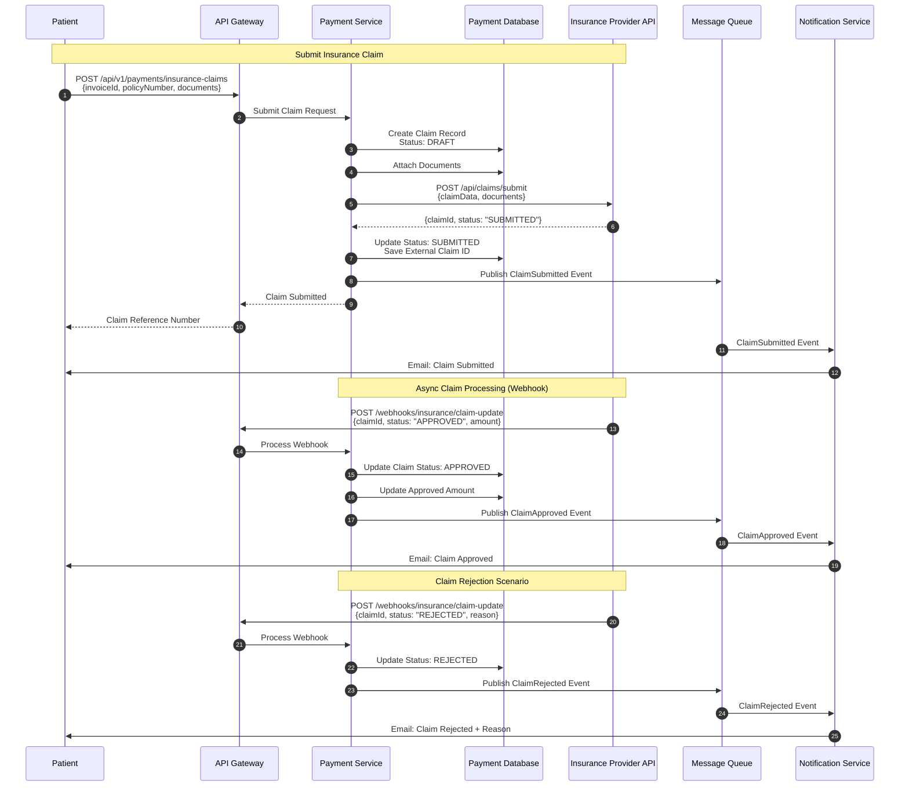

---

### 4. Laboratory Systems Integration (HL7/FHIR)

Diagram ini menunjukkan integrasi dengan laboratory systems menggunakan HL7 dan FHIR standards.

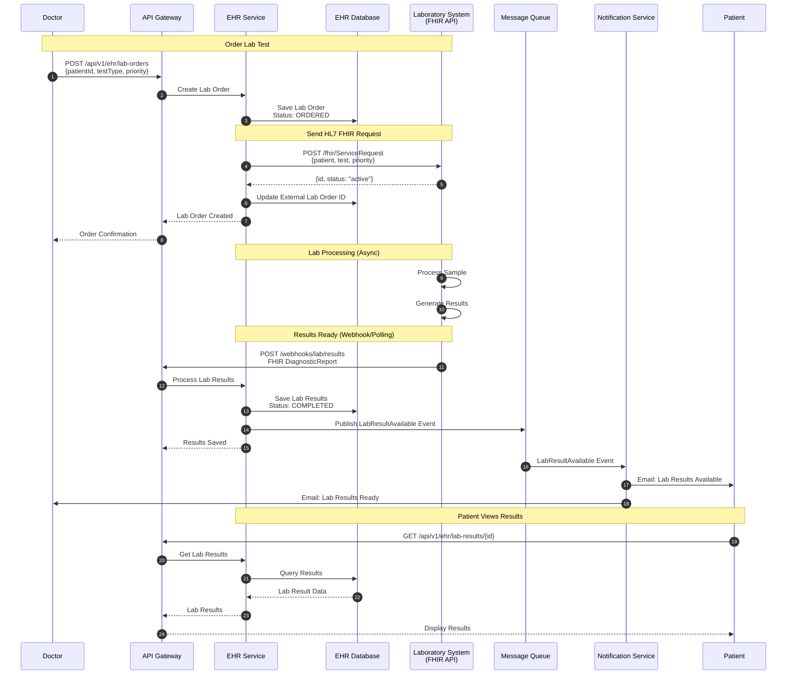

---

### 5. Email & SMS Service Integration

Diagram ini menunjukkan integrasi dengan communication services.

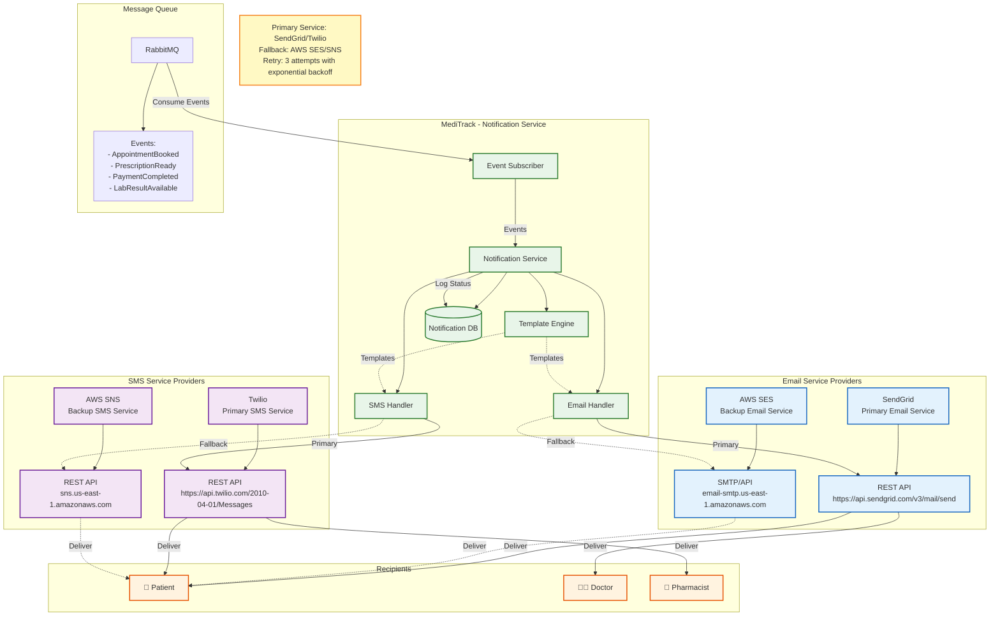

---

### 6. External API Integration Summary Table

| External System | Purpose | Protocol | Authentication | MediTrack Service | Fallback |
|----------------|---------|----------|----------------|-------------------|----------|
| **Stripe** | Payment Processing | HTTPS/REST | API Key | Payment Service | PayPal |
| **PayPal** | Payment Processing | HTTPS/REST | OAuth 2.0 | Payment Service | Stripe |
| **Insurance Provider A** | Claims Processing | HTTPS/SOAP | API Key + Certificate | Payment Service | Manual Processing |
| **Insurance Provider B** | Claims Verification | HTTPS/REST | OAuth 2.0 | Payment Service | Manual Processing |
| **Laboratory System A** | Lab Results | HL7 FHIR | OAuth 2.0 | EHR Service | Manual Entry |
| **Laboratory System B** | Lab Orders | HL7 v2.x | VPN + Certificate | EHR Service | Manual Entry |
| **RxNorm Drug Database** | Drug Information | HTTPS/REST | Public API | Pharmacy Service | Local Database |
| **External Pharmacy Network** | Stock Sync | HTTPS/REST | API Key | Pharmacy Service | Manual Update |
| **SendGrid** | Email Delivery | HTTPS/REST | API Key | Notification Service | AWS SES |
| **AWS SES** | Email Delivery | SMTP/API | AWS Credentials | Notification Service | SendGrid |
| **Twilio** | SMS Delivery | HTTPS/REST | API Key + Secret | Notification Service | AWS SNS |
| **AWS SNS** | SMS Delivery | HTTPS/REST | AWS Credentials | Notification Service | Twilio |
| **Firebase FCM** | Push Notifications | HTTPS/REST | Server Key | Notification Service | None |
| **AWS S3** | Document Storage | HTTPS/REST | AWS Credentials | EHR Service | MinIO |
| **MinIO** | Document Storage | HTTPS/REST | Access Key + Secret | EHR Service | AWS S3 |

---

### 7. API Security & Integration Patterns

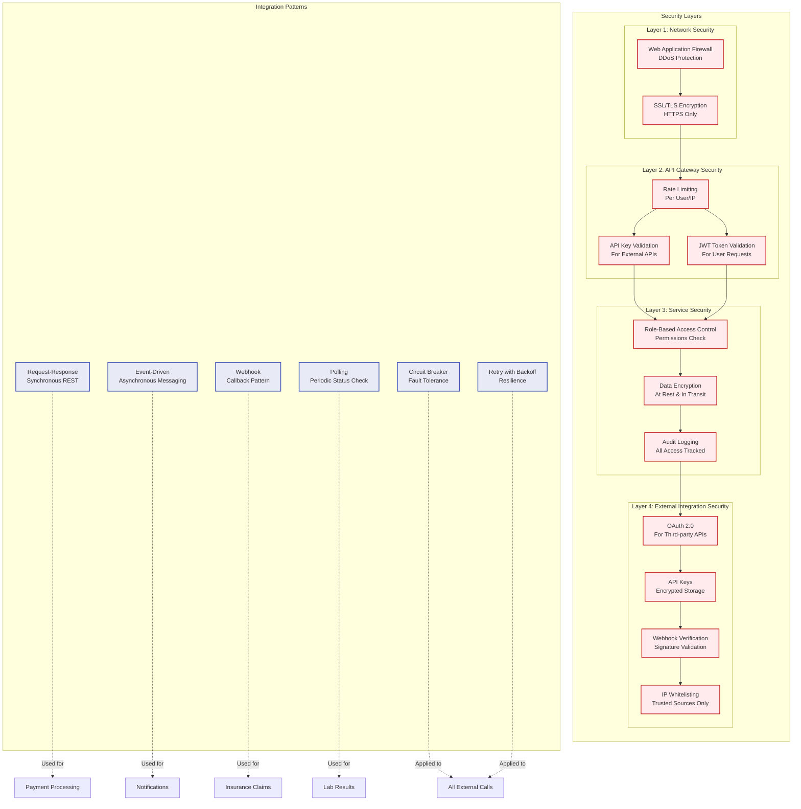

---

## Kesimpulan

### Ringkasan Visualisasi Arsitektur

Laporan ini telah menyajikan visualisasi komprehensif dari arsitektur MediTrack yang mencakup:

#### A. High-Level Architecture Diagram
1. **Complete System Architecture**: Menampilkan semua komponen, services, data flow, dan integration points
2. **Layered Architecture View**: Arsitektur dalam 9 layers untuk pemahaman hierarki
3. **Data Flow Diagrams**: Aliran data untuk use cases spesifik (appointment booking, prescription order)

#### B. Service Boundaries untuk Microservices
1. **Service Boundary Diagram**: Batasan jelas untuk setiap microservice dengan komponen internal
2. **Service Communication Patterns**: Pola komunikasi synchronous dan asynchronous
3. **Database per Service Pattern**: Isolasi database untuk setiap service

#### C. External Systems Integration
1. **External Integration Architecture**: Overview integrasi dengan semua external systems
2. **Payment Gateway Integration**: Detail integrasi Stripe dan PayPal
3. **Insurance Claims Integration**: Proses claims submission dan processing
4. **Laboratory Systems Integration**: HL7/FHIR integration untuk lab results
5. **Email & SMS Service Integration**: Multi-channel notification delivery
6. **Integration Summary Table**: Reference lengkap untuk semua external integrations
7. **API Security & Integration Patterns**: Security layers dan integration patterns

---

### Key Highlights

#### 1. Clear Service Boundaries
- Setiap microservice memiliki boundary yang jelas
- Database per service untuk data isolation
- No direct database access antar services
- Communication via APIs dan events only

#### 2. Comprehensive Data Flow
- Synchronous communication untuk real-time operations
- Asynchronous communication untuk notifications dan analytics
- Event-driven architecture untuk loose coupling
- Circuit breaker dan retry patterns untuk resilience

#### 3. External Integration Points
- **Payment Systems**: Stripe, PayPal dengan fallback mechanism
- **Insurance Providers**: Multiple providers dengan webhook support
- **Healthcare Systems**: HL7/FHIR standards untuk interoperability
- **Communication Services**: SendGrid, Twilio dengan fallback ke AWS
- **Storage Systems**: S3/MinIO untuk medical documents

#### 4. Security Layers
- Network security (WAF, SSL/TLS)
- API Gateway security (rate limiting, JWT validation)
- Service-level security (RBAC, encryption)
- External integration security (OAuth 2.0, API keys, webhooks)

#### 5. Observability
- Centralized logging (ELK Stack)
- Metrics collection (Prometheus)
- Distributed tracing (Zipkin)
- Dashboards (Grafana)

---

### Benefits untuk Team

#### 1. Untuk Developers
- Clear understanding of service boundaries
- Well-defined integration points
- Documented data flows
- Security requirements clearly specified

#### 2. Untuk DevOps
- Infrastructure requirements visible
- Deployment architecture clear
- Monitoring points identified
- Scaling strategies defined

#### 3. Untuk Architects
- High-level overview available
- Integration patterns documented
- Security layers defined
- Extensibility points clear

#### 4. Untuk Stakeholders
- System capabilities visible
- External dependencies identified
- Data flow transparent
- Compliance requirements addressed

---

### Implementation Guidance

#### Phase 1: Core Infrastructure
1. Setup Service Registry (Eureka)
2. Setup Config Server
3. Setup API Gateway
4. Setup Message Queue (RabbitMQ)
5. Setup Cache (Redis)

#### Phase 2: Core Services
1. Implement User Service
2. Implement Appointment Service
3. Implement EHR Service
4. Setup basic monitoring

#### Phase 3: Business Services
1. Implement Pharmacy Service
2. Implement Payment Service
3. Integrate payment gateways
4. Implement Notification Service

#### Phase 4: Analytics & External Integration
1. Implement Analytics Service
2. Integrate laboratory systems
3. Integrate insurance providers
4. Complete monitoring setup

---

### Maintenance & Evolution

#### Regular Updates Required
- External API versions
- Security certificates
- Integration credentials
- Service configurations

#### Monitoring Points
- External API availability
- Integration success rates
- Response times
- Error rates

#### Documentation Updates
- New external integrations
- API changes
- Security updates
- Architecture decisions

---

**Dokumentasi ini memberikan blueprint lengkap untuk implementasi dan maintenance platform MediTrack dengan fokus pada clarity, security, dan scalability.**
