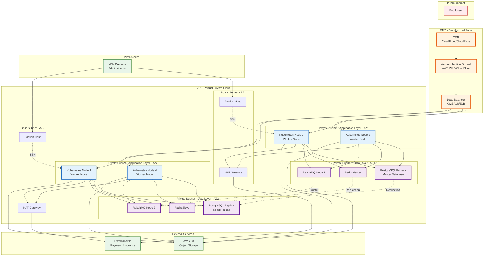
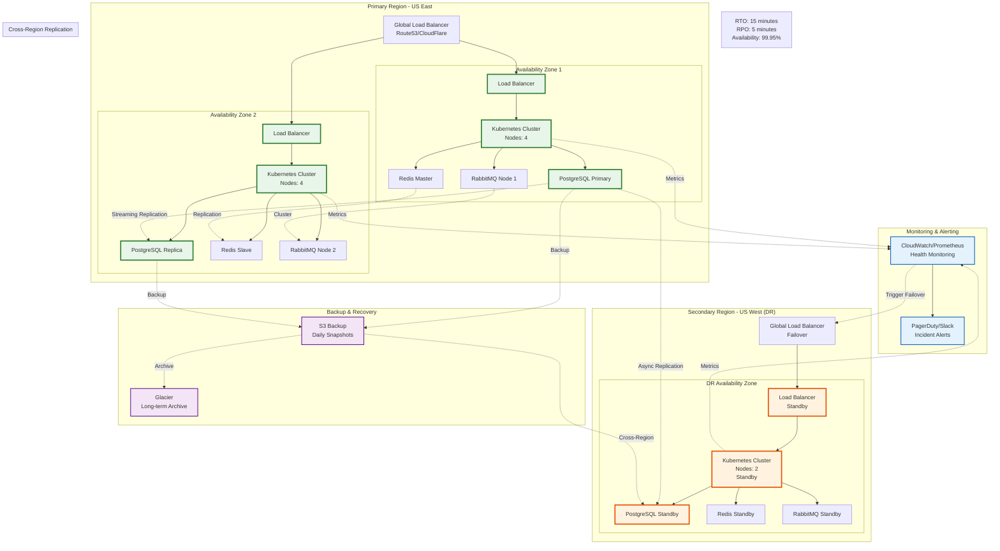

# Deployment & Infrastructure Diagrams

## 1. Kubernetes Deployment Architecture

```mermaid
graph TB
    subgraph "External Traffic"
        Internet[Internet Users]
        DNS[DNS<br/>Route53/CloudFlare]
    end

    subgraph "Kubernetes Cluster - Production"
        subgraph "Ingress Layer"
            Ingress[Ingress Controller<br/>NGINX/Traefik<br/>SSL Termination]
        end

        subgraph "API Gateway Namespace"
            GW_Deploy[API Gateway Deployment<br/>Replicas: 3]
            GW_Service[API Gateway Service<br/>ClusterIP]
            GW_HPA[Horizontal Pod Autoscaler<br/>Min: 3, Max: 10]
            
            GW_Deploy --> GW_Service
            GW_HPA -.->|Scale| GW_Deploy
        end

        subgraph "User Service Namespace"
            US_Deploy[User Service Deployment<br/>Replicas: 3]
            US_Service[User Service<br/>ClusterIP]
            US_HPA[HPA<br/>Min: 2, Max: 5]
            US_PVC[PersistentVolumeClaim<br/>Database Storage]
            US_DB[PostgreSQL StatefulSet<br/>User Database]
            
            US_Deploy --> US_Service
            US_HPA -.->|Scale| US_Deploy
            US_DB --> US_PVC
        end

        subgraph "Appointment Service Namespace"
            AS_Deploy[Appointment Service<br/>Replicas: 5]
            AS_Service[Appointment Service<br/>ClusterIP]
            AS_HPA[HPA<br/>Min: 3, Max: 10]
            AS_PVC[PVC<br/>Database Storage]
            AS_DB[PostgreSQL StatefulSet<br/>Appointment Database]
            
            AS_Deploy --> AS_Service
            AS_HPA -.->|Scale| AS_Deploy
            AS_DB --> AS_PVC
        end

        subgraph "EHR Service Namespace"
            EHR_Deploy[EHR Service<br/>Replicas: 4]
            EHR_Service[EHR Service<br/>ClusterIP]
            EHR_HPA[HPA<br/>Min: 2, Max: 8]
            EHR_PVC[PVC<br/>Database Storage]
            EHR_DB[PostgreSQL StatefulSet<br/>EHR Database]
            
            EHR_Deploy --> EHR_Service
            EHR_HPA -.->|Scale| EHR_Deploy
            EHR_DB --> EHR_PVC
        end

        subgraph "Pharmacy Service Namespace"
            PS_Deploy[Pharmacy Service<br/>Replicas: 2]
            PS_Service[Pharmacy Service<br/>ClusterIP]
            PS_HPA[HPA<br/>Min: 2, Max: 6]
            PS_PVC[PVC<br/>Database Storage]
            PS_DB[PostgreSQL StatefulSet<br/>Pharmacy Database]
            
            PS_Deploy --> PS_Service
            PS_HPA -.->|Scale| PS_Deploy
            PS_DB --> PS_PVC
        end

        subgraph "Payment Service Namespace"
            PAY_Deploy[Payment Service<br/>Replicas: 3]
            PAY_Service[Payment Service<br/>ClusterIP]
            PAY_HPA[HPA<br/>Min: 2, Max: 8]
            PAY_PVC[PVC<br/>Database Storage]
            PAY_DB[PostgreSQL StatefulSet<br/>Payment Database]
            
            PAY_Deploy --> PAY_Service
            PAY_HPA -.->|Scale| PAY_Deploy
            PAY_DB --> PAY_PVC
        end

        subgraph "Analytics Service Namespace"
            AN_Deploy[Analytics Service<br/>Replicas: 2]
            AN_Service[Analytics Service<br/>ClusterIP]
            AN_HPA[HPA<br/>Min: 1, Max: 4]
            AN_PVC[PVC<br/>Database Storage]
            AN_DB[PostgreSQL StatefulSet<br/>Analytics Database]
            
            AN_Deploy --> AN_Service
            AN_HPA -.->|Scale| AN_Deploy
            AN_DB --> AN_PVC
        end

        subgraph "Notification Service Namespace"
            NOT_Deploy[Notification Service<br/>Replicas: 3]
            NOT_Service[Notification Service<br/>ClusterIP]
            NOT_HPA[HPA<br/>Min: 2, Max: 8]
            
            NOT_Deploy --> NOT_Service
            NOT_HPA -.->|Scale| NOT_Deploy
        end

        subgraph "Infrastructure Namespace"
            REG_Deploy[Service Registry<br/>Replicas: 3]
            REG_Service[Eureka Service<br/>ClusterIP]
            
            CONF_Deploy[Config Server<br/>Replicas: 2]
            CONF_Service[Config Service<br/>ClusterIP]
            
            MQ_StatefulSet[RabbitMQ StatefulSet<br/>Replicas: 3]
            MQ_Service[RabbitMQ Service<br/>ClusterIP]
            MQ_PVC[PVC<br/>Message Storage]
            
            REDIS_StatefulSet[Redis StatefulSet<br/>Replicas: 3<br/>Master-Slave]
            REDIS_Service[Redis Service<br/>ClusterIP]
            REDIS_PVC[PVC<br/>Cache Storage]
            
            REG_Deploy --> REG_Service
            CONF_Deploy --> CONF_Service
            MQ_StatefulSet --> MQ_Service
            MQ_StatefulSet --> MQ_PVC
            REDIS_StatefulSet --> REDIS_Service
            REDIS_StatefulSet --> REDIS_PVC
        end

        subgraph "Monitoring Namespace"
            PROM[Prometheus<br/>StatefulSet]
            GRAF[Grafana<br/>Deployment]
            ELK[ELK Stack<br/>StatefulSet]
            ZIPKIN[Zipkin<br/>Deployment]
        end
    end

    subgraph "External Storage"
        S3[AWS S3<br/>Medical Documents]
        RDS[AWS RDS<br/>Backup Databases]
    end

    subgraph "External Services"
        ExtAPIs[External APIs<br/>Payment, Insurance, Lab]
    end

    %% Traffic Flow
    Internet --> DNS
    DNS --> Ingress
    Ingress --> GW_Service

    %% Gateway to Services
    GW_Service --> US_Service
    GW_Service --> AS_Service
    GW_Service --> EHR_Service
    GW_Service --> PS_Service
    GW_Service --> PAY_Service
    GW_Service --> AN_Service

    %% Service Registry
    US_Service -.->|Register| REG_Service
    AS_Service -.->|Register| REG_Service
    EHR_Service -.->|Register| REG_Service
    PS_Service -.->|Register| REG_Service
    PAY_Service -.->|Register| REG_Service
    AN_Service -.->|Register| REG_Service
    NOT_Service -.->|Register| REG_Service

    %% Config Server
    US_Service -.->|Config| CONF_Service
    AS_Service -.->|Config| CONF_Service
    EHR_Service -.->|Config| CONF_Service

    %% Message Queue
    AS_Service --> MQ_Service
    EHR_Service --> MQ_Service
    PS_Service --> MQ_Service
    PAY_Service --> MQ_Service
    NOT_Service --> MQ_Service
    AN_Service --> MQ_Service

    %% Redis Cache
    US_Service --> REDIS_Service
    AS_Service --> REDIS_Service
    PS_Service --> REDIS_Service
    GW_Service --> REDIS_Service

    %% External Storage
    EHR_Service --> S3
    US_DB -.->|Backup| RDS
    AS_DB -.->|Backup| RDS
    EHR_DB -.->|Backup| RDS

    %% External Services
    PAY_Service --> ExtAPIs
    EHR_Service --> ExtAPIs

    %% Monitoring
    US_Service -.->|Metrics| PROM
    AS_Service -.->|Metrics| PROM
    EHR_Service -.->|Metrics| PROM
    PROM --> GRAF
    US_Service -.->|Logs| ELK
    GW_Service -.->|Traces| ZIPKIN

    classDef namespaceStyle fill:#e8eaf6,stroke:#3f51b5,stroke-width:3px
    classDef deployStyle fill:#c8e6c9,stroke:#2e7d32,stroke-width:2px
    classDef dbStyle fill:#f3e5f5,stroke:#6a1b9a,stroke-width:2px
    classDef infraStyle fill:#fff9c4,stroke:#f57f17,stroke-width:2px
    classDef monitorStyle fill:#e0f2f1,stroke:#00695c,stroke-width:2px
    classDef externalStyle fill:#ffebee,stroke:#c62828,stroke-width:2px

    class GW_Deploy,US_Deploy,AS_Deploy,EHR_Deploy,PS_Deploy,PAY_Deploy,AN_Deploy,NOT_Deploy deployStyle
    class US_DB,AS_DB,EHR_DB,PS_DB,PAY_DB,AN_DB dbStyle
    class REG_Deploy,CONF_Deploy,MQ_StatefulSet,REDIS_StatefulSet infraStyle
    class PROM,GRAF,ELK,ZIPKIN monitorStyle
    class S3,RDS,ExtAPIs externalStyle
```

---

## 2. Container Architecture

```mermaid
graph TB
    subgraph "Docker Container Structure"
        subgraph "API Gateway Container"
            GW_Base[Base Image<br/>openjdk:21-jdk-slim]
            GW_App[Spring Boot Application<br/>api-gateway.jar]
            GW_Config[Configuration<br/>application.yml]
            GW_Port[Exposed Port: 8080]
            
            GW_Base --> GW_App
            GW_App --> GW_Config
            GW_App --> GW_Port
        end

        subgraph "User Service Container"
            US_Base[Base Image<br/>openjdk:21-jdk-slim]
            US_App[Spring Boot Application<br/>user-service.jar]
            US_Config[Configuration<br/>application.yml]
            US_Port[Exposed Port: 8081]
            US_Health[Health Check<br/>/actuator/health]
            
            US_Base --> US_App
            US_App --> US_Config
            US_App --> US_Port
            US_App --> US_Health
        end

        subgraph "Appointment Service Container"
            AS_Base[Base Image<br/>openjdk:21-jdk-slim]
            AS_App[Spring Boot Application<br/>appointment-service.jar]
            AS_Config[Configuration<br/>application.yml]
            AS_Port[Exposed Port: 8082]
            AS_Health[Health Check<br/>/actuator/health]
            
            AS_Base --> AS_App
            AS_App --> AS_Config
            AS_App --> AS_Port
            AS_App --> AS_Health
        end

        subgraph "PostgreSQL Container"
            PG_Base[Base Image<br/>postgres:16]
            PG_Data[Data Volume<br/>/var/lib/postgresql/data]
            PG_Init[Init Scripts<br/>schema.sql]
            PG_Port[Exposed Port: 5432]
            
            PG_Base --> PG_Data
            PG_Base --> PG_Init
            PG_Base --> PG_Port
        end

        subgraph "RabbitMQ Container"
            MQ_Base[Base Image<br/>rabbitmq:3-management]
            MQ_Data[Data Volume<br/>/var/lib/rabbitmq]
            MQ_Port1[AMQP Port: 5672]
            MQ_Port2[Management: 15672]
            
            MQ_Base --> MQ_Data
            MQ_Base --> MQ_Port1
            MQ_Base --> MQ_Port2
        end

        subgraph "Redis Container"
            REDIS_Base[Base Image<br/>redis:7-alpine]
            REDIS_Data[Data Volume<br/>/data]
            REDIS_Config[redis.conf]
            REDIS_Port[Exposed Port: 6379]
            
            REDIS_Base --> REDIS_Data
            REDIS_Base --> REDIS_Config
            REDIS_Base --> REDIS_Port
        end
    end

    subgraph "Docker Network"
        Network[meditrack-network<br/>Bridge Network]
    end

    subgraph "Docker Volumes"
        Vol_User[(user-db-data)]
        Vol_Appt[(appointment-db-data)]
        Vol_EHR[(ehr-db-data)]
        Vol_MQ[(rabbitmq-data)]
        Vol_Redis[(redis-data)]
    end

    %% Network Connections
    GW_Port -.->|Connected| Network
    US_Port -.->|Connected| Network
    AS_Port -.->|Connected| Network
    PG_Port -.->|Connected| Network
    MQ_Port1 -.->|Connected| Network
    REDIS_Port -.->|Connected| Network

    %% Volume Mounts
    PG_Data --> Vol_User
    PG_Data --> Vol_Appt
    PG_Data --> Vol_EHR
    MQ_Data --> Vol_MQ
    REDIS_Data --> Vol_Redis

    classDef containerStyle fill:#e3f2fd,stroke:#1565c0,stroke-width:2px
    classDef volumeStyle fill:#f3e5f5,stroke:#6a1b9a,stroke-width:2px
    classDef networkStyle fill:#fff3e0,stroke:#e65100,stroke-width:2px

    class GW_Base,US_Base,AS_Base,PG_Base,MQ_Base,REDIS_Base containerStyle
    class Vol_User,Vol_Appt,Vol_EHR,Vol_MQ,Vol_Redis volumeStyle
    class Network networkStyle
```

---

## 3. CI/CD Pipeline

```mermaid
graph LR
    subgraph "Source Control"
        Git[Git Repository<br/>GitHub/GitLab]
        Branch[Feature Branch]
        PR[Pull Request]
        Main[Main Branch]
        
        Branch -->|Create| PR
        PR -->|Merge| Main
    end

    subgraph "CI Pipeline - Build & Test"
        Trigger[Webhook Trigger]
        Checkout[Checkout Code]
        Build[Maven Build<br/>mvn clean install]
        UnitTest[Unit Tests<br/>mvn test]
        IntTest[Integration Tests]
        SonarQube[Code Quality<br/>SonarQube]
        Security[Security Scan<br/>OWASP Dependency Check]
        
        Trigger --> Checkout
        Checkout --> Build
        Build --> UnitTest
        UnitTest --> IntTest
        IntTest --> SonarQube
        SonarQube --> Security
    end

    subgraph "Container Build"
        DockerBuild[Docker Build<br/>docker build]
        DockerTag[Tag Image<br/>version + latest]
        DockerPush[Push to Registry<br/>Docker Hub/ECR]
        
        Security --> DockerBuild
        DockerBuild --> DockerTag
        DockerTag --> DockerPush
    end

    subgraph "CD Pipeline - Deploy"
        subgraph "Development"
            DevDeploy[Deploy to Dev<br/>kubectl apply]
            DevTest[Smoke Tests]
            DevDeploy --> DevTest
        end

        subgraph "Staging"
            StageDeploy[Deploy to Staging<br/>kubectl apply]
            StageTest[E2E Tests]
            StageApproval[Manual Approval]
            StageDeploy --> StageTest
            StageTest --> StageApproval
        end

        subgraph "Production"
            ProdDeploy[Blue-Green Deploy<br/>kubectl apply]
            ProdHealth[Health Check]
            ProdSwitch[Switch Traffic]
            ProdRollback[Rollback if Failed]
            
            ProdDeploy --> ProdHealth
            ProdHealth -->|Success| ProdSwitch
            ProdHealth -->|Failed| ProdRollback
        end
    end

    subgraph "Monitoring & Notification"
        Monitor[Monitoring<br/>Prometheus/Grafana]
        Alert[Alerting<br/>PagerDuty/Slack]
        Logs[Centralized Logs<br/>ELK Stack]
        
        Monitor --> Alert
        Monitor --> Logs
    end

    %% Flow
    Main --> Trigger
    DockerPush --> DevDeploy
    DevTest --> StageDeploy
    StageApproval --> ProdDeploy
    ProdSwitch --> Monitor
    ProdRollback --> Alert

    classDef sourceStyle fill:#e8f5e9,stroke:#2e7d32,stroke-width:2px
    classDef ciStyle fill:#e3f2fd,stroke:#1565c0,stroke-width:2px
    classDef containerStyle fill:#f3e5f5,stroke:#6a1b9a,stroke-width:2px
    classDef cdStyle fill:#fff3e0,stroke:#e65100,stroke-width:2px
    classDef monitorStyle fill:#fce4ec,stroke:#c2185b,stroke-width:2px

    class Git,Branch,PR,Main sourceStyle
    class Trigger,Checkout,Build,UnitTest,IntTest,SonarQube,Security ciStyle
    class DockerBuild,DockerTag,DockerPush containerStyle
    class DevDeploy,StageDeploy,ProdDeploy cdStyle
    class Monitor,Alert,Logs monitorStyle
```

---

## 4. Network Architecture

---

## 5. High Availability & Disaster Recovery

---

## 6. Scaling Strategy

```mermaid
graph TB
    subgraph "Auto-Scaling Triggers"
        CPU[CPU Usage > 70%]
        Memory[Memory Usage > 80%]
        RequestRate[Request Rate > 1000/s]
        QueueDepth[Queue Depth > 1000]
        ResponseTime[Response Time > 500ms]
    end

    subgraph "Horizontal Pod Autoscaler (HPA)"
        HPA_Gateway[API Gateway HPA<br/>Min: 3, Max: 10]
        HPA_User[User Service HPA<br/>Min: 2, Max: 5]
        HPA_Appt[Appointment Service HPA<br/>Min: 3, Max: 10]
        HPA_EHR[EHR Service HPA<br/>Min: 2, Max: 8]
        HPA_Pharm[Pharmacy Service HPA<br/>Min: 2, Max: 6]
        HPA_Pay[Payment Service HPA<br/>Min: 2, Max: 8]
        HPA_Notif[Notification Service HPA<br/>Min: 2, Max: 8]
    end

    subgraph "Vertical Pod Autoscaler (VPA)"
        VPA_Rec[Resource Recommendations]
        VPA_Apply[Auto-apply Resources]
    end

    subgraph "Cluster Autoscaler"
        CA[Cluster Autoscaler]
        NodePool[Node Pool<br/>Min: 4, Max: 20]
    end

    subgraph "Database Scaling"
        DB_ReadReplica[Add Read Replicas]
        DB_Sharding[Database Sharding<br/>Future]
        DB_ConnectionPool[Connection Pool Tuning]
    end

    subgraph "Cache Scaling"
        Redis_Cluster[Redis Cluster Mode]
        Redis_Replica[Add Redis Replicas]
    end

    subgraph "Message Queue Scaling"
        MQ_Nodes[Add RabbitMQ Nodes]
        MQ_Partitions[Increase Partitions]
    end

    %% Trigger to HPA
    CPU --> HPA_Gateway
    CPU --> HPA_User
    CPU --> HPA_Appt
    Memory --> HPA_EHR
    RequestRate --> HPA_Gateway
    RequestRate --> HPA_Appt
    QueueDepth --> HPA_Notif
    ResponseTime --> HPA_Pay

    %% HPA to VPA
    HPA_Gateway -.->|Resource Analysis| VPA_Rec
    HPA_User -.->|Resource Analysis| VPA_Rec
    VPA_Rec --> VPA_Apply

    %% HPA to Cluster Autoscaler
    HPA_Gateway -.->|Need More Nodes| CA
    HPA_Appt -.->|Need More Nodes| CA
    CA --> NodePool

    %% Scaling Actions
    CPU --> DB_ReadReplica
    Memory --> Redis_Cluster
    QueueDepth --> MQ_Nodes

    classDef triggerStyle fill:#ffebee,stroke:#c62828,stroke-width:2px
    classDef hpaStyle fill:#e3f2fd,stroke:#1565c0,stroke-width:2px
    classDef vpaStyle fill:#f3e5f5,stroke:#6a1b9a,stroke-width:2px
    classDef caStyle fill:#fff3e0,stroke:#e65100,stroke-width:2px
    classDef dataStyle fill:#e8f5e9,stroke:#2e7d32,stroke-width:2px

    class CPU,Memory,RequestRate,QueueDepth,ResponseTime triggerStyle
    class HPA_Gateway,HPA_User,HPA_Appt,HPA_EHR,HPA_Pharm,HPA_Pay,HPA_Notif hpaStyle
    class VPA_Rec,VPA_Apply vpaStyle
    class CA,NodePool caStyle
    class DB_ReadReplica,Redis_Cluster,MQ_Nodes dataStyle
```

---

## 7. Security Architecture

```mermaid
graph TB
    subgraph "Perimeter Security"
        DDoS[DDoS Protection<br/>AWS Shield/CloudFlare]
        WAF[Web Application Firewall<br/>OWASP Rules]
        SSL[SSL/TLS Termination<br/>Certificate Management]
    end

    subgraph "Network Security"
        VPC[VPC Isolation<br/>Private Subnets]
        SG[Security Groups<br/>Firewall Rules]
        NACL[Network ACLs<br/>Subnet Level]
        VPN[VPN Gateway<br/>Admin Access]
    end

    subgraph "Application Security"
        subgraph "API Gateway Security"
            JWT[JWT Validation]
            OAuth[OAuth 2.0]
            RateLimit[Rate Limiting]
            CORS[CORS Policy]
        end

        subgraph "Service Security"
            RBAC[Role-Based Access Control]
            ServiceMesh[Service Mesh<br/>Istio/Linkerd]
            mTLS[Mutual TLS<br/>Service-to-Service]
        end
    end

    subgraph "Data Security"
        EncryptRest[Encryption at Rest<br/>AES-256]
        EncryptTransit[Encryption in Transit<br/>TLS 1.3]
        KeyManagement[Key Management<br/>AWS KMS/Vault]
        DataMasking[Data Masking<br/>PII Protection]
    end

    subgraph "Identity & Access"
        IAM[IAM Roles<br/>AWS IAM]
        ServiceAccount[Service Accounts<br/>Kubernetes]
        Secrets[Secrets Management<br/>Kubernetes Secrets/Vault]
    end

    subgraph "Compliance & Audit"
        AuditLog[Audit Logging<br/>All Access Tracked]
        Compliance[HIPAA Compliance<br/>Healthcare Standards]
        Backup[Encrypted Backups<br/>Retention Policy]
    end

    subgraph "Monitoring & Detection"
        IDS[Intrusion Detection<br/>AWS GuardDuty]
        SIEM[SIEM<br/>Security Analytics]
        VulnScan[Vulnerability Scanning<br/>Trivy/Clair]
    end

    %% Flow
    DDoS --> WAF
    WAF --> SSL
    SSL --> VPC
    VPC --> SG
    SG --> NACL

    NACL --> JWT
    JWT --> OAuth
    OAuth --> RateLimit
    RateLimit --> CORS

    CORS --> RBAC
    RBAC --> ServiceMesh
    ServiceMesh --> mTLS

    mTLS --> EncryptRest
    EncryptRest --> EncryptTransit
    EncryptTransit --> KeyManagement
    KeyManagement --> DataMasking

    DataMasking --> IAM
    IAM --> ServiceAccount
    ServiceAccount --> Secrets

    Secrets --> AuditLog
    AuditLog --> Compliance
    Compliance --> Backup

    Backup --> IDS
    IDS --> SIEM
    SIEM --> VulnScan

    classDef perimeterStyle fill:#ffebee,stroke:#c62828,stroke-width:2px
    classDef networkStyle fill:#fff3e0,stroke:#e65100,stroke-width:2px
    classDef appStyle fill:#e3f2fd,stroke:#1565c0,stroke-width:2px
    classDef dataStyle fill:#f3e5f5,stroke:#6a1b9a,stroke-width:2px
    classDef identityStyle fill:#e8f5e9,stroke:#2e7d32,stroke-width:2px
    classDef complianceStyle fill:#fce4ec,stroke:#c2185b,stroke-width:2px
    classDef monitorStyle fill:#e0f2f1,stroke:#00695c,stroke-width:2px

    class DDoS,WAF,SSL perimeterStyle
    class VPC,SG,NACL,VPN networkStyle
    class JWT,OAuth,RateLimit,CORS,RBAC,ServiceMesh,mTLS appStyle
    class EncryptRest,EncryptTransit,KeyManagement,DataMasking dataStyle
    class IAM,ServiceAccount,Secrets identityStyle
    class AuditLog,Compliance,Backup complianceStyle
    class IDS,SIEM,VulnScan monitorStyle
```

---

## Infrastructure Summary

### Resource Requirements

| Component | CPU | Memory | Storage | Replicas | Auto-scale |
|-----------|-----|--------|---------|----------|------------|
| **API Gateway** | 1 core | 1 GB | 1 GB | 3 | 3-10 |
| **User Service** | 1 core | 1 GB | 5 GB | 2 | 2-5 |
| **Appointment Service** | 1 core | 1 GB | 10 GB | 3 | 3-10 |
| **EHR Service** | 2 cores | 2 GB | 50 GB | 2 | 2-8 |
| **Pharmacy Service** | 1 core | 1 GB | 10 GB | 2 | 2-6 |
| **Payment Service** | 1 core | 1 GB | 10 GB | 2 | 2-8 |
| **Analytics Service** | 2 cores | 2 GB | 20 GB | 1 | 1-4 |
| **Notification Service** | 1 core | 1 GB | 5 GB | 2 | 2-8 |
| **PostgreSQL** | 2 cores | 4 GB | 100 GB | 1 per service | No |
| **RabbitMQ** | 1 core | 2 GB | 10 GB | 3 | No |
| **Redis** | 1 core | 2 GB | 5 GB | 3 | No |

### Estimated Monthly Cost (AWS)

| Service | Cost |
|---------|------|
| **EC2 Instances** (Kubernetes nodes) | $800 |
| **RDS PostgreSQL** (7 instances) | $1,400 |
| **ElastiCache Redis** | $200 |
| **Amazon MQ** (RabbitMQ) | $300 |
| **S3 Storage** | $100 |
| **Load Balancer** | $50 |
| **Data Transfer** | $200 |
| **CloudWatch** | $50 |
| **Backup & DR** | $150 |
| **Total** | **~$3,250/month** |

### Deployment Checklist

- [ ] Setup VPC with public/private subnets
- [ ] Configure security groups and NACLs
- [ ] Deploy Kubernetes cluster (EKS/GKE)
- [ ] Setup RDS PostgreSQL instances
- [ ] Configure ElastiCache Redis
- [ ] Deploy RabbitMQ cluster
- [ ] Setup S3 buckets for storage
- [ ] Configure load balancers
- [ ] Setup DNS and SSL certificates
- [ ] Deploy monitoring stack (Prometheus, Grafana)
- [ ] Configure centralized logging (ELK)
- [ ] Setup CI/CD pipelines
- [ ] Configure backup and DR
- [ ] Implement security policies
- [ ] Setup alerting and notifications
- [ ] Perform security audit
- [ ] Load testing
- [ ] Disaster recovery testing

---

**Dokumentasi deployment dan infrastructure ini memberikan panduan lengkap untuk setup production-ready environment untuk platform MediTrack.**
